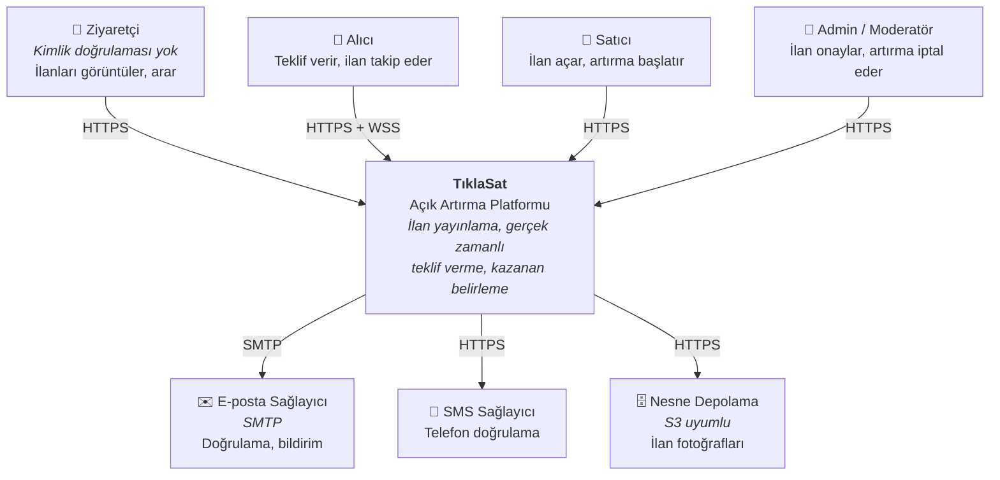
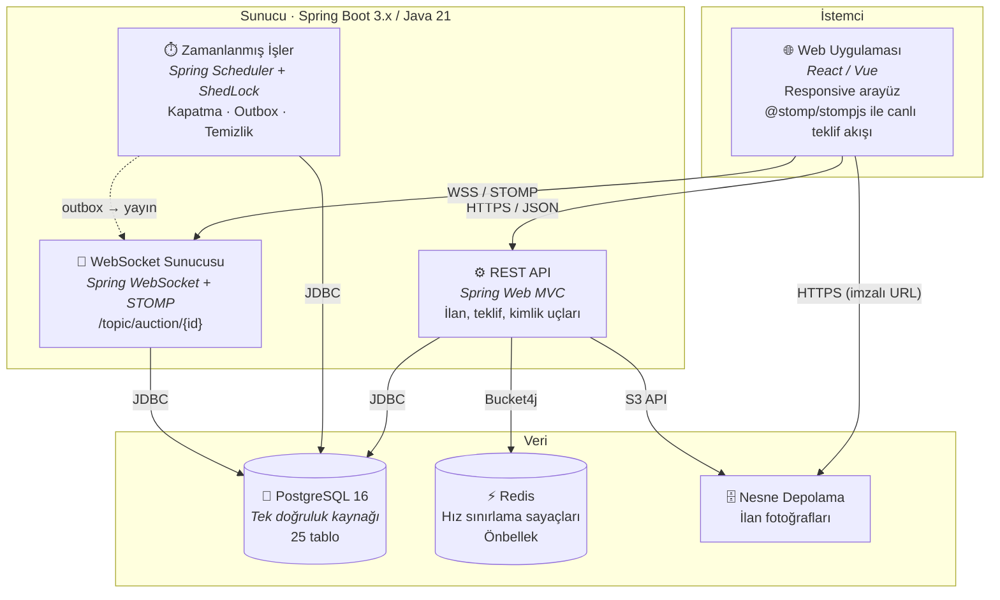
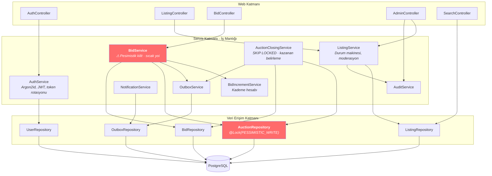
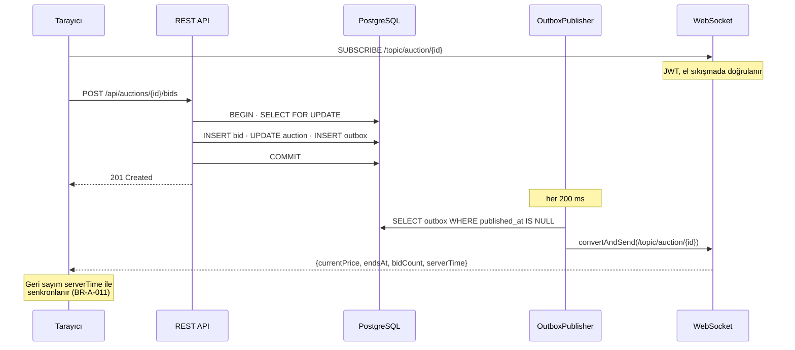
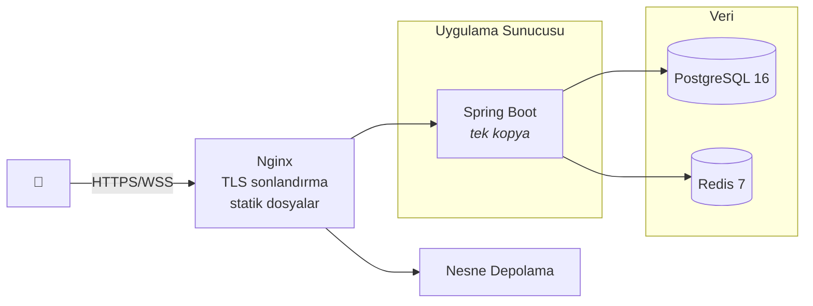

# TıklaSat — Sistem Mimarisi

| | |
|---|---|
| **Doküman** | Sistem Mimarisi (C4 Modeli) |
| **Sürüm** | 1.0 |
| **Tarih** | 2026-07-30 |
| **İlgili ADR** | `ADR-0001`, `ADR-0002`, `ADR-0004` |

---

## C4 modeli nedir?

Yazılım mimarisini **dört zoom seviyesinde** anlatma yöntemi. Bir haritanın ülke → şehir → mahalle → sokak görünümleri gibi:

| Seviye | Sorusu | Okuyucusu |
|---|---|---|
| **1 · Context** | Sistem dış dünyayla nasıl konuşur? | Herkes (teknik olmayanlar dahil) |
| **2 · Container** | Hangi çalıştırılabilir parçalar var? | Geliştiriciler, DevOps |
| **3 · Component** | Bir parçanın içi nasıl bölünmüş? | Geliştiriciler |
| **4 · Code** | Sınıflar ve ilişkileri | (Çizilmez — kod zaten kendisi anlatır) |

Bu doküman ilk üç seviyeyi kapsar.

---

## Seviye 1 · Context



### Kapsam sınırı

| İçeride | Dışarıda (`BR-N-005`) |
|---|---|
| İlan yayınlama ve moderasyon | Ödeme altyapısı |
| Gerçek zamanlı teklif motoru | Emanet (escrow) |
| Kazanan belirleme | Kargo ve teslimat takibi |
| İletişim bilgisi ifşası | Fatura kesimi |
| Karşılıklı puanlama | |

> **Neden ödeme dışarıda?** Kapsamı ikiye katlar ve teklif motorunun kalitesinden feragat gerektirirdi. Platform kazananı belirler ve tarafları buluşturur; ticaretin geri kalanı platform dışında yürür — sahibinden.com modelinin aynısı.

---

## Seviye 2 · Container



### Container'lar

| Container | Teknoloji | Sorumluluk |
|---|---|---|
| **Web Uygulaması** | React/Vue + `@stomp/stompjs` | Arayüz, canlı teklif akışı, responsive tasarım (`BR-S-009`) |
| **REST API** | Spring Web MVC | İş mantığı, doğrulama, yetkilendirme |
| **WebSocket Sunucusu** | Spring WebSocket + STOMP | Artırma başına kanal yayını (`BR-B-009`) |
| **Zamanlanmış İşler** | Spring Scheduler + ShedLock | Artırma kapatma (`BR-A-007`), outbox yayını, veri temizliği (`BR-K-005`) |
| **PostgreSQL** | 16 | **Tek doğruluk kaynağı.** Tüm iş verisi ve kısıtlar |
| **Redis** | 7 | Hız sınırlama sayaçları (`BR-S-002`), kategori/kademe önbelleği |
| **Nesne Depolama** | S3 uyumlu | Fotoğraflar. Görsel **asla** veritabanında saklanmaz |

> **Neden hepsi tek Spring Boot uygulaması?** REST API, WebSocket ve zamanlanmış işler mimari olarak ayrılabilirdi (mikroservis). **Ayrılmadı:** üçü de aynı veriye erişiyor, aynı transaction sınırlarını paylaşıyor ve toplam trafik tek bir uygulamanın kapasitesinin çok altında. Mikroservise bölmek, kazanç getirmeden dağıtık sistem problemlerini (ağ hataları, dağıtık transaction, servis keşfi) davet ederdi.
>
> **Modüler monolit** yaklaşımı benimsenmiştir: paketler alan sınırlarına göre ayrılır, ancak tek süreçte çalışır. İleride bir alan gerçekten ayrı ölçeklenmeye ihtiyaç duyarsa, sınır zaten çizilmiş olur.

### Redis neden var, neden PostgreSQL yetmiyor?

Hız sınırlama sayacı her istekte güncellenir. Bunu PostgreSQL'de tutmak, her HTTP isteğine bir disk yazması eklemek demektir — teklif yolunun kilit bütçesiyle rekabet eder. Ayrıca sayaçlar **kalıcı olmak zorunda değildir**: Redis yeniden başlarsa sayaçlar sıfırlanır, bu kabul edilebilir bir davranıştır.

**İlke:** Kalıcılığı zorunlu olmayan, çok sık yazılan veri PostgreSQL'e konmaz.

---

## Seviye 3 · Component (REST API'nin içi)



### Katman kuralları

| Kural | Gerekçe |
|---|---|
| Controller **iş mantığı içermez** | Test edilebilirlik; mantık HTTP'den bağımsız olmalı |
| Transaction sınırı **servis katmanındadır** | Controller'da `@Transactional` = HTTP serileştirmesi transaction içinde kalır, kilit süresi uzar |
| Repository **iş kuralı bilmez** | Sorgu ve kilitleme dışında sorumluluğu yoktur |
| Entity'ler **API'ye sızmaz** | DTO kullanılır; `auctions.reserve_price` gibi gizli alanlar (`BR-A-003`) kazara döndürülemez |
| `BidService` dışındaki hiçbir servis `auctions` satırını **kilitlemez** | Deadlock riskini sıfırda tutar |

### Paket yapısı

```
com.tiklasat
├── auth/          · kimlik, JWT, roller
├── user/          · kullanıcı profili, puanlama
├── catalog/       · kategoriler, EAV tanımları
├── listing/       · ilan, fotoğraf, moderasyon
├── auction/       · ⚠ artırma, teklif, kapatma  ← sıcak yol
│   ├── domain/
│   ├── service/       BidService, AuctionClosingService, BidIncrementService
│   ├── repository/    @Lock burada
│   └── web/
├── notification/  · bildirim, outbox yayıncısı
├── search/        · tam metin + EAV filtreleme
├── admin/         · şikayet, denetim, yönetim
└── common/        · ortak yapılandırma, hata yönetimi, saat (Clock)
```

> `auction` paketi projenin **kalbidir** ve en yoğun test kapsamına sahip olmalıdır.

---

## Gerçek Zamanlı Akış



**Neden yayın API'den doğrudan yapılmıyor?** Transaction geri alınırsa kullanıcılar var olmayan bir teklif görürdü; yayın kaybolursa ekranlar donuk kalırdı. Outbox her ikisini de çözer (`BR-N-007`, `ADR-0004` ilgili bölüm).

---

## Dağıtım (v1)



### v1 bilinçli sınırları

| Sınır | Neden kabul edildi | Ne zaman aşılır |
|---|---|---|
| Tek uygulama kopyası | STOMP yayını çoklu kopyada mesaj aracısı gerektirir | Trafik tek sunucuyu doldurunca → RabbitMQ STOMP relay |
| Tek veritabanı düğümü | Yazma yolu bölünemez; okuma yükü henüz düşük | Okuma yükü artınca → okuma replikası |
| Yedekleme: günlük tam yedek + WAL arşivi | Veri kaybı toleransı v1 için yeterli | Sıfır kayıp gerekirse → senkron replikasyon |

> ShedLock ve `SKIP LOCKED` **şimdiden** kurulmuştur (`V7`, `ADR-0004`). Tek kopya çalışırken gerekli değiller; ikinci kopya eklendiği gün **kod değişikliği olmadan** doğru çalışsın diye baştan konmuşlardır. Bu, ucuz ve geri dönüşü yüksek bir hazırlıktır.

---

## Kalite Nitelikleri

| Nitelik | Hedef | Nasıl sağlanıyor |
|---|---|---|
| **Doğruluk** | Yarış koşulundan veri bozulması = 0 | Pesimistik kilit + `UNIQUE` + `CHECK` (üç katman) |
| **Gerçek zamanlılık** | Yayın gecikmesi p95 < 1 sn | WebSocket + outbox (200 ms anketleme) |
| **Güvenlik** | Argon2id, JWT, hız sınırlama, metot seviyesi yetki | Spring Security + Bucket4j |
| **Denetlenebilirlik** | Her kritik işlem izlenebilir | `audit_logs`, `auction_extensions`, `contact_disclosures` |
| **Bakım yapılabilirlik** | Kararlar gerekçesiyle kayıtlı | ADR'ler + izlenebilirlik matrisi |
| **KVKK uyumu** | Anonimleştirme, ifşa izi, saklama süreleri | `BR-K-001..006` |

---

## İlgili

- [ADR-0001](../03-decisions/ADR-0001-java-spring-boot-stack.md) — yığın seçimi
- [ADR-0002](../03-decisions/ADR-0002-postgresql-ve-flyway.md) — veritabanı ve şema yönetimi
- [ADR-0004](../03-decisions/ADR-0004-pesimistik-kilit.md) — kilitleme stratejisi
- [data-model.md](data-model.md) — 25 tablonun veri sözlüğü
- [concurrency-design.md](concurrency-design.md) — teklif motorunun tam akışı
