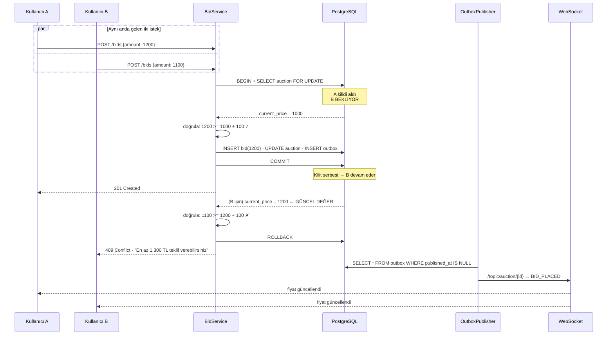

# TıklaSat — Eşzamanlılık Tasarımı

| | |
|---|---|
| **Doküman** | Eşzamanlılık Tasarımı (Concurrency Design) |
| **Sürüm** | 1.0 |
| **Tarih** | 2026-07-30 |
| **Kapsanan kurallar** | `BR-B-007`, `BR-B-008`, `BR-A-006`, `BR-A-007`, `BR-A-010`, `BR-N-007` |
| **İlgili ADR** | `ADR-0004` (pesimistik kilit) |

---

> **Bu dokümanın önemi:** Bir açık artırma platformunda teklif motoru dışındaki her şey standart CRUD'dur. Projeyi teknik olarak ayrıştıran tek yer burasıdır — ve staj savunmasında sorulacak asıl sorular buradan çıkar.

---

## 1. Problem: Kaybolan Güncelleme

Açık artırmanın son 10 saniyesinde onlarca kullanıcı **aynı satıra** yazmaya çalışır. Naif "önce oku, sonra yaz" mantığı burada sessizce bozulur.

### 1.1 Somut hata izi

Mevcut fiyat 1000 TL, kademe artışı 100 TL. İki kullanıcı aynı anda teklif veriyor:

```
zaman   Kullanıcı A                     Kullanıcı B                    DB current_price
─────   ──────────────────────────      ─────────────────────────      ────────────────
t=0ms   SELECT current_price → 1000                                          1000
t=1ms                                   SELECT current_price → 1000          1000
t=2ms   doğrula: 1200 >= 1100 ✓                                              1000
t=3ms                                   doğrula: 1100 >= 1100 ✓              1000
t=4ms   UPDATE → 1200                                                        1200
t=5ms   INSERT bid(1200)                                                     1200
t=6ms                                   UPDATE → 1100                        1100  ⚠
t=7ms                                   INSERT bid(1100)                     1100
─────────────────────────────────────────────────────────────────────────────────────
SONUÇ:  Fiyat 1100. A'nın 1200 TL'lik teklifi VERİTABANINDA VAR ama
        current_price onu görmüyor. Sistem daha DÜŞÜK teklifi kazanan
        gösteriyor. Hiçbir hata mesajı yok — sessiz veri bozulması.
```

Bu hata **her zaman** olmaz; yalnızca iki isteğin milisaniyeler içinde çakıştığı anda olur. Yani düşük trafikte fark edilmez, **açık artırmanın en kritik anında** ortaya çıkar. Test edilmesi zor, sonucu ise platformun güvenilirliğini yok eden bir hatadır.

### 1.2 İkinci hata biçimi: yayın/veri tutarsızlığı

WebSocket yayını transaction'ın **içinden** yapılırsa:

| Senaryo | Sonuç |
|---|---|
| Yayın gitti → transaction rollback | Tüm izleyiciler **var olmayan** bir teklif gördü. Ekranda 1200 TL yazıyor, veritabanında 1000 TL. |
| Transaction commit → yayın kayboldu | Ekranlar **donuk** kaldı. Kullanıcılar eski fiyata teklif verdi, hepsi reddedildi, kimse nedenini anlamadı. |

---

## 2. Çözüm: Pesimistik Satır Kilidi

Teklif işlemi **tek ve kısa** bir transaction içinde, `auctions` satırı kilitlenerek yürütülür.

### 2.1 Transaction akışı

```sql
BEGIN;

-- (1) SIRAYA SOK
--     Bu satırı kilitler. Aynı artırmaya teklif veren diğer istekler
--     burada BEKLER (hata almaz, sıraya girer). Farklı artırmalar
--     birbirini hiç etkilemez → paralellik korunur.
SELECT * FROM auctions WHERE id = :auctionId FOR UPDATE;

-- (2) DOĞRULA — artık okuduğumuz değerin değişmeyeceğinden EMİNİZ
--     · status = 'ACTIVE'                          (BR-A-010)
--     · now() < ends_at                            (BR-B-001)
--     · bidder_id <> listing.seller_id             (BR-B-002)
--     · bidder_id <> highest_bid.bidder_id         (BR-B-006)
--     · amount >= current_price + kademe_artışı    (BR-B-003)

-- (3) TEKLİFİ YAZ
INSERT INTO bids (id, auction_id, bidder_id, amount, status, ip_address, user_agent)
VALUES (:bidId, :auctionId, :bidderId, :amount, 'WINNING', :ip, :ua);

-- (4) ÖNCEKİ EN YÜKSEK TEKLİFİ GEÇİLDİ İŞARETLE
UPDATE bids SET status = 'OUTBID' WHERE id = :previousHighestBidId;

-- (5) ARTIRMAYI GÜNCELLE  (+ sniper uzatması varsa ends_at)
UPDATE auctions
   SET current_price   = :amount,
       highest_bid_id  = :bidId,
       bid_count       = bid_count + 1,
       ends_at         = :newEndsAt,
       extension_count = :newExtensionCount
 WHERE id = :auctionId;

-- (6) UZATMA OLDUYSA DENETİM KAYDI                 (BR-A-006)
INSERT INTO auction_extensions (...) VALUES (...);

-- (7) OUTBOX'A OLAY YAZ — yayın DOĞRUDAN yapılmaz  (BR-N-007)
INSERT INTO outbox_events (aggregate_type, aggregate_id, event_type, payload)
VALUES ('AUCTION', :auctionId, 'BID_PLACED', :payload),
       ('USER', :previousBidderId, 'USER_OUTBID', :payload);

COMMIT;   -- kilit BURADA serbest kalır, sıradaki istek devam eder
```

### 2.2 Sekans diyagramı



**Kritik nokta:** B, A'nın yazdığı **güncel** fiyatı okur. `FOR UPDATE` olmasaydı B eski değeri (1000) okur ve 1100 TL'lik teklifi geçerli sanılırdı — §1.1'deki hata tam olarak budur.

B'nin reddedilmesi bir **arıza değil, doğru davranıştır**: teklifi gerçekten yetersizdir ve kullanıcıya net bir mesajla söylenir (`BR-B-011`).

---

## 3. Neden Pesimistik, Neden Optimistik Değil?

> Bu, savunmada en olası sorudur.

| | Optimistik (`@Version`) | Pesimistik (`FOR UPDATE`) |
|---|---|---|
| Varsayım | "Çakışma **olmaz**" | "Çakışma **olur**" |
| Çakışmada | İşlemi reddeder, **yeniden dene** der | İsteği **sıraya** alır |
| Uygun olduğu yer | Çakışma **nadir** | Çakışma **sık** |
| Yük altında | Retry sayısı **katlanarak artar** | Sabit, öngörülebilir |

**Açık artırmanın son 10 saniyesinde çakışma istisna değil, kuraldır.**

Optimistik kilit seçilseydi ne olurdu:

```
20 eşzamanlı teklif
  → 1 başarılı, 19 sürüm çakışması
  → 19 istemci yeniden dener
  → yine 1 başarılı, 18 çakışma
  → 18 yeniden dener...
```

Toplam ~190 transaction, sistemin **en yoğun** anında. Buna **retry fırtınası** denir: yük arttıkça sistem daha da yavaşlar, yavaşladıkça daha çok retry üretir. Kendini besleyen bir çöküş döngüsüdür.

Pesimistik kilitle 20 istek → **20 transaction**. Her biri tam olarak bir kez çalışır. Bekleme süresi öngörülebilir ve adildir (ilk gelen ilk işlenir).

> **Genel kural:** Çakışma olasılığı düşükse optimistik, yüksekse pesimistik. Açık artırmanın son saniyeleri tanım gereği "yüksek"tir.

### 3.1 Peki `auctions.version` neden hâlâ var?

Optimistik kilit **teklif dışı** güncellemeler için ikinci güvenlik ağıdır:

- Admin artırmayı iptal ederken (`BR-A-012`)
- Moderatör ilan durumunu değiştirirken
- Kapatma işi artırmayı sonlandırırken

Bu işlemler nadirdir; çakışmaları da nadirdir. Optimistik kilit tam olarak bu profile uyar. **İki mekanizma aynı tabloda, farklı yollar için birlikte kullanılır** — bu bir çelişki değil, yerinde araç seçimidir.

---

## 4. Üç Katmanlı Savunma

Kritik sistemlerde savunma tek katmana bırakılmaz.

| # | Katman | Neyi engeller | Nerede |
|---|---|---|---|
| 1 | `SELECT ... FOR UPDATE` | Kaybolan güncelleme | Servis katmanı |
| 2 | `UNIQUE (auction_id, amount)` | **Kilit mekanizması hatalıysa** aynı tutarın iki kez yazılması | Veritabanı |
| 3 | `CHECK` kısıtları | Geçersiz durumun veritabanına ulaşması | Veritabanı |

**2. katmanın anlamı:** Diyelim ki kodda bir hata var, `@Transactional` unutulmuş veya `@Lock` yanlış repository metoduna konmuş. İki teklif aynı anda `current_price = 1000` görüp ikisi de `1100` yazmaya kalkarsa, `INSERT` sırasında PostgreSQL ikincisini **reddeder**. Benzersizlik kontrolü atomiktir; hiçbir yarış koşulu onu atlatamaz.

Yani 1. katman doğruluğu sağlar, 2. katman **1. katmanın kendisi bozulursa** devreye girer.

**Ek fayda — kazara çift tıklama:** Kullanıcı "Teklif Ver" butonuna iki kez basarsa aynı tutarla iki istek gider. İkincisi `uq_bids_auction_amount` ihlaline takılır ve reddedilir. Ayrı bir idempotency mekanizması yazmadan, doğal olarak korunmuş oluruz.

---

## 5. Uygulama (Spring Boot)

### 5.1 Repository — kilit burada tanımlanır

```java
public interface AuctionRepository extends JpaRepository<Auction, UUID> {

    /**
     * BR-B-007 · Teklif yolunun ilk adımı.
     * PESSIMISTIC_WRITE → SELECT ... FOR UPDATE
     *
     * lock.timeout: kilitte 3 saniyeden fazla bekleyen istek hata alır.
     * Olmasaydı, kilidi tutan bir transaction takıldığında arkasındaki
     * tüm istekler thread havuzunu tüketene kadar beklerdi (thread
     * starvation) ve TÜM sistem yanıt veremez hale gelirdi.
     */
    @Lock(LockModeType.PESSIMISTIC_WRITE)
    @QueryHints(@QueryHint(name = "jakarta.persistence.lock.timeout", value = "3000"))
    @Query("SELECT a FROM Auction a WHERE a.id = :id")
    Optional<Auction> findByIdForUpdate(@Param("id") UUID id);
}
```

> ⚠️ **Sık yapılan hata:** Kilidi `findById()` ile alıp sonra ayrı bir metotta güncellemek. Kilit **transaction sonunda** serbest kalır; iki ayrı `@Transactional` metot = iki ayrı transaction = kilit arada düşer ve koruma çalışmaz. Kilit alma ile güncelleme **aynı transaction içinde** olmak zorundadır.

### 5.2 Servis — tek transaction

```java
@Service
@RequiredArgsConstructor
public class BidService {

    private final AuctionRepository auctionRepository;
    private final BidRepository bidRepository;
    private final ListingRepository listingRepository;
    private final BidIncrementService incrementService;
    private final OutboxService outboxService;
    private final Clock clock;   // BR-A-011 · zaman enjekte edilir, test edilebilir olsun

    private static final Duration SNIPE_WINDOW    = Duration.ofSeconds(120);
    private static final Duration SNIPE_EXTENSION = Duration.ofSeconds(120);
    private static final int      MAX_EXTENSIONS  = 20;

    /**
     * BR-B-007, BR-B-008 · Teklif kabulü ve fiyat güncellemesi ATOMİKTİR.
     *
     * timeout = 5: transaction 5 saniyeden uzun sürerse geri alınır.
     * Sıcak yolda uzun süren transaction, arkasındaki herkesi bekletir.
     * Kilidi tutma süresi bir BÜTÇEDİR ve aşılmamalıdır.
     */
    @Transactional(timeout = 5)
    public BidResult placeBid(UUID auctionId, UUID bidderId,
                             BigDecimal amount, RequestContext ctx) {

        // (1) KİLİTLE — bu noktadan sonra artırma satırı bize ait
        Auction auction = auctionRepository.findByIdForUpdate(auctionId)
                .orElseThrow(() -> new AuctionNotFoundException(auctionId));

        Instant now = clock.instant();

        // (2) DOĞRULA
        validateAuctionOpen(auction, now);              // BR-A-010, BR-B-001
        validateNotSeller(auction, bidderId);           // BR-B-002
        validateNotAlreadyWinning(auction, bidderId);   // BR-B-006

        BigDecimal minimum = incrementService.minimumNextBid(auction.getCurrentPrice());
        if (amount.compareTo(minimum) < 0) {
            // BR-B-011 · hata mesajı kabul edilebilir tutarı İÇERİR
            throw new BidTooLowException(amount, minimum);
        }

        // (3) TEKLİFİ YAZ · append-only (BR-B-005)
        Bid bid = bidRepository.save(Bid.of(auction, bidderId, amount, ctx));

        // (4) ÖNCEKİ EN YÜKSEĞİ GEÇİLDİ İŞARETLE
        UUID previousBidderId = null;
        if (auction.getHighestBidId() != null) {
            Bid previous = bidRepository.getReferenceById(auction.getHighestBidId());
            previous.setStatus(BidStatus.OUTBID);
            previousBidderId = previous.getBidderId();
        }

        // (5) SNIPER KORUMASI (BR-A-006)
        Optional<AuctionExtension> extension = applyAntiSnipe(auction, bid, now);

        // (6) ARTIRMAYI GÜNCELLE
        auction.setCurrentPrice(amount);
        auction.setHighestBidId(bid.getId());
        auction.setBidCount(auction.getBidCount() + 1);

        // (7) OUTBOX — WebSocket yayını BURADA YAPILMAZ (BR-N-007)
        outboxService.append(BidPlacedEvent.of(auction, bid));
        if (previousBidderId != null) {
            outboxService.append(UserOutbidEvent.of(auction, previousBidderId));
        }
        extension.ifPresent(e -> outboxService.append(AuctionExtendedEvent.of(auction, e)));

        return BidResult.accepted(bid, auction, extension.isPresent());
    }   // ← COMMIT · kilit burada serbest kalır
}
```

### 5.3 Sniper koruması

```java
/**
 * BR-A-006 · Son 120 saniyede gelen teklif bitişi "şimdi + 120sn" yapar.
 *
 * ⚠ FORMÜL KRİTİK: now + EXTENSION kullanılır, ends_at + EXTENSION DEĞİL.
 *
 *   ends_at + 120sn  → art arda teklifler bitişi 2'şer dakika ileri atar,
 *                      araya 10 saniye girse bile. Süre teklif sayısıyla şişer.
 *   now + 120sn      → değişmez garanti: "son teklifin üzerinden 120 saniye
 *                      geçmeden artırma bitmez." Anti-sniping'in amacı budur.
 */
private Optional<AuctionExtension> applyAntiSnipe(Auction auction, Bid bid, Instant now) {
    Duration remaining = Duration.between(now, auction.getEndsAt());

    boolean inWindow      = !remaining.isNegative() && remaining.compareTo(SNIPE_WINDOW) <= 0;
    boolean underCap      = auction.getExtensionCount() < MAX_EXTENSIONS;
    if (!inWindow || !underCap) {
        return Optional.empty();
    }

    Instant previousEnd = auction.getEndsAt();
    Instant newEnd      = now.plus(SNIPE_EXTENSION);

    // 60 dakikalık toplam tavan · DB'de ck_auctions_extension_window ile de zorlanır.
    // NOT: Bu kod yolunda pratikte hiç tetiklenmez — MAX_EXTENSIONS (20) sayaç
    // tavanı, her uzatmanın en fazla ~120sn eklediği bu mekanizmayla ~40 dakikada
    // dolar. 60 dakikalık sınır, pencere/uzatma süresi ileride büyütülürse diye
    // konmuş bağımsız bir üst güvenlik ağıdır (BR-A-006, ADR-0006).
    Instant hardCap = auction.getOriginalEndsAt().plus(Duration.ofMinutes(60));
    if (newEnd.isAfter(hardCap)) {
        newEnd = hardCap;
    }
    if (!newEnd.isAfter(previousEnd)) {
        return Optional.empty();   // tavana dayandı, uzatma yok
    }

    auction.setEndsAt(newEnd);
    auction.setExtensionCount(auction.getExtensionCount() + 1);

    return Optional.of(extensionRepository.save(
        AuctionExtension.of(auction, bid, previousEnd, newEnd)));
}
```

### 5.4 Kademeli artış hesabı

```java
/**
 * BR-B-003 · Minimum teklif = mevcut fiyat + kademe artışı.
 * Kademeler VERİTABANINDAN okunur (bid_increment_tiers) — kodda sabit değildir.
 * ex_tiers_no_overlap kısıtı sayesinde tam olarak BİR kademe eşleşir.
 */
public BigDecimal minimumNextBid(BigDecimal currentPrice) {
    BidIncrementTier tier = tierRepository.findMatching(currentPrice)
            .orElseThrow(() -> new IllegalStateException(
                    "Fiyat için kademe bulunamadı: " + currentPrice));

    BigDecimal increment = switch (tier.getIncrementType()) {
        case FIXED      -> tier.getIncrementValue();
        case PERCENTAGE -> currentPrice
                .multiply(tier.getIncrementValue())
                .divide(BigDecimal.valueOf(100), 2, RoundingMode.CEILING);
    };

    // BR-B-003 · yukarı yuvarlama · kullanıcıya küsuratlı tutar gösterilmez
    return currentPrice.add(increment).setScale(2, RoundingMode.CEILING);
}
```

> `RoundingMode.CEILING` bilinçlidir: aşağı yuvarlansaydı, gösterilen minimum tutar bazen gerçek minimumun **altında** kalır ve kullanıcının "önerilen tutarı girdim ama reddedildi" yaşaması mümkün olurdu.

---

## 6. Açık Artırmayı Kim Kapatır? (BR-A-007)

Kullanıcı isteği değil, **zamanlanmış iş** kapatır. Siteye kimse girmese bile artırma zamanında sonlanmalıdır.

### 6.1 İki katmanlı çakışma koruması

Üretimde uygulama 2+ kopya çalışır; zamanlanmış iş **her kopyada** tetiklenir.

```java
@Component
@RequiredArgsConstructor
public class AuctionClosingJob {

    /**
     * BR-A-007
     *
     * Katman 1 — @SchedulerLock (ShedLock): iş aynı anda yalnızca BİR
     *            kopyada başlar. Kaba taneli, iş seviyesinde.
     *
     * Katman 2 — FOR UPDATE SKIP LOCKED (sorgu içinde): ShedLock kilidi
     *            zaman aşımına uğrasa bile aynı ARTIRMA iki kez işlenemez.
     *            İnce taneli, satır seviyesinde.
     *
     * Tek katman yetmez: ShedLock kilidi zaman aşımına dayanır. Donmuş bir
     * kopya tam kilit düştükten sonra uyanırsa iki kopya birlikte çalışabilir.
     * SKIP LOCKED bu boşluğu veritabanı seviyesinde kapatır.
     */
    @Scheduled(fixedDelay = 5_000)
    @SchedulerLock(name = "auctionClosingJob",
                   lockAtMostFor = "PT30S", lockAtLeastFor = "PT2S")
    public void closeExpiredAuctions() {
        int processed;
        do {
            processed = closingService.closeBatch(100);
        } while (processed == 100);   // tam parti geldiyse devam et
    }
}
```

```java
public interface AuctionRepository extends JpaRepository<Auction, UUID> {

    /**
     * SKIP LOCKED: kilitli satırı BEKLEME, sıradakine geç.
     * Birden fazla kopya aynı kuyruğu çakışmadan işleyebilir.
     *
     * ⚠ PostgreSQL sözdiziminde kilitleme yan tümcesi LIMIT'ten SONRA gelir.
     */
    @Query(value = """
            SELECT * FROM auctions
             WHERE status = 'ACTIVE'
               AND ends_at <= now()
             ORDER BY ends_at
             LIMIT :batchSize
             FOR UPDATE SKIP LOCKED
            """, nativeQuery = true)
    List<Auction> lockExpiredAuctions(@Param("batchSize") int batchSize);
}
```

### 6.2 Kapanış mantığı

```java
@Transactional(timeout = 30)
public int closeBatch(int batchSize) {
    List<Auction> expired = auctionRepository.lockExpiredAuctions(batchSize);

    for (Auction auction : expired) {
        // ⚠ Kilidi aldıktan sonra ends_at'i TEKRAR kontrol et.
        // Sorgu ile kilit arasında bir teklif gelip sniper uzatması
        // yapmış olabilir (BR-A-006). Bu, klasik bir "check-then-act"
        // tuzağıdır ve gözden kaçması çok kolaydır.
        if (auction.getEndsAt().isAfter(clock.instant())) {
            continue;   // uzatıldı, henüz bitmedi
        }

        if (auction.getBidCount() == 0) {
            auction.close(AuctionStatus.ENDED_NO_BIDS);          // BR-A-009

        } else {
            Bid highest = bidRepository.getReferenceById(auction.getHighestBidId());

            // BR-A-008 · rezerv fiyat denetimi
            boolean reserveMet = auction.getReservePrice() == null
                    || highest.getAmount().compareTo(auction.getReservePrice()) >= 0;

            if (reserveMet) {
                auction.setWinnerUserId(highest.getBidderId());
                auction.close(AuctionStatus.ENDED_SOLD);
                highest.setStatus(BidStatus.WON);
                bidRepository.markAllOthersLost(auction.getId(), highest.getId());
                outboxService.append(AuctionWonEvent.of(auction, highest));
            } else {
                auction.close(AuctionStatus.ENDED_RESERVE_NOT_MET);
                bidRepository.markAllLost(auction.getId());
                outboxService.append(ReserveNotMetEvent.of(auction));
            }
        }
        outboxService.append(AuctionClosedEvent.of(auction));
    }
    return expired.size();
}
```

> **Neden `fixedDelay = 5s`?** Kapanış gecikmesi en fazla 5 saniyedir; kullanıcı için fark edilmez. Daha sık çalıştırmak (örn. 500ms) boş sorgu sayısını 10 katına çıkarır, kazanç getirmez. Daha seyrek (örn. 60s) çalıştırmak ise "artırma bitti ama sonuç 1 dakika sonra göründü" şikâyeti üretir.

---

## 7. Outbox Yayıncısı (BR-N-007)

```java
@Component
@RequiredArgsConstructor
public class OutboxPublisher {

    @Scheduled(fixedDelay = 200)
    @SchedulerLock(name = "outboxPublisher", lockAtMostFor = "PT10S")
    @Transactional(timeout = 10)
    public void publishPending() {
        // Sıra ÖNEMLİ: olaylar üretildikleri sırayla yayınlanmalıdır,
        // yoksa istemci "fiyat 1200" mesajını "fiyat 1100"den önce alabilir.
        List<OutboxEvent> pending = outboxRepository.lockUnpublished(200);

        for (OutboxEvent event : pending) {
            try {
                messagingTemplate.convertAndSend(
                        "/topic/auction/" + event.getAggregateId(),
                        event.getPayload());
                event.setPublishedAt(clock.instant());
            } catch (Exception ex) {
                event.setAttemptCount(event.getAttemptCount() + 1);
                event.setLastError(ex.getMessage());
                // published_at NULL kalır → sonraki turda tekrar denenir
            }
        }
    }
}
```

**En az bir kez teslim (at-least-once):** Yayın başarılı olur ama `published_at` yazılmadan süreç çökerse, olay bir kez daha yayınlanır. Bu kabul edilebilir bir davranıştır — istemci tarafı olayları **idempotent** işler: gelen fiyat, ekrandakinden büyük değilse yok sayılır. Aynı mesajı iki kez almak zararsızdır; **hiç almamak** ise zararlıdır.

---

## 8. Kilidi Tutma Süresi Bütçesi

Teklif yolu, kilidi tutan tek yerdir. Bekleyen her isteğin gecikmesi bu süreye eşittir.

| Adım | Hedef |
|---|---|
| `SELECT ... FOR UPDATE` | < 1 ms (birincil anahtar araması) |
| Doğrulama (kademe sorgusu dahil) | < 2 ms |
| `INSERT bids` + `UPDATE auctions` | < 3 ms |
| Outbox `INSERT` | < 1 ms |
| **Toplam kilit süresi** | **< 10 ms** |

Bu bütçe, tek bir artırmada **saniyede ~100 teklife** karşılık gelir. Türkiye ölçeğinde bir platform için fazlasıyla yeterlidir.

### Kilit süresini uzatan ve **yasak** olan işlemler

| Yasak | Neden |
|---|---|
| Transaction içinde HTTP çağrısı | Ağ gecikmesi kilidi saniyelerce tutar |
| Transaction içinde e-posta/SMS | Aynı sebep · outbox üzerinden yapılır |
| Transaction içinde WebSocket yayını | Aynı sebep · outbox üzerinden yapılır |
| Transaction içinde dosya/görsel işleme | CPU yoğun, öngörülemez süre |
| Aynı transaction'da birden fazla artırmayı kilitleme | **Ölümcül kilitlenme (deadlock)** riski |

> **Deadlock neden imkânsız?** Teklif yolunda her transaction **tek bir** `auctions` satırı kilitler. Ölümcül kilitlenme, en az iki kilidin karşılıklı beklenmesini gerektirir. Tek kilit varken bu yapısal olarak oluşamaz. Kapatma işi çoklu satır kilitler ama `SKIP LOCKED` beklemeyi tamamen ortadan kaldırır — orada da deadlock mümkün değildir.

---

## 9. Hata Senaryoları ve Beklenen Davranış

| Senaryo | Beklenen davranış | HTTP |
|---|---|---|
| Teklif kademenin altında | Reddet, **minimum tutarı bildir** (`BR-B-011`) | `409` |
| Artırma bu arada kapandı | Reddet (`BR-A-010`) | `409` |
| Satıcı kendi ilanına teklif verdi | Reddet + `audit_logs` kaydı (`BR-B-002`) | `403` |
| Kullanıcı zaten en yüksek teklif sahibi | Reddet (`BR-B-006`) | `409` |
| Aynı tutar iki kez (çift tıklama) | 2. istek benzersizlik ihlaline takılır | `409` |
| Kilit 3 sn'de alınamadı | `LockTimeoutException` → yeniden denemesi söylenir | `503` |
| Transaction 5 sn'yi aştı | Geri alınır, hiçbir kısmi değişiklik kalmaz | `500` |
| Hız sınırı aşıldı (`BR-S-002`) | Reddet | `429` |
| Outbox yayını başarısız | Teklif **geçerli kalır**, olay tekrar denenir | — |
| Veritabanı kapandı | Transaction geri alınır, veri tutarlı kalır | `503` |

> Hiçbir senaryoda "kısmen kabul edilmiş teklif" durumu oluşmaz — `BR-B-008`'in tanımı budur.

---

## 10. Test Planı

### 10.1 Neden Testcontainers, neden H2 değil?

Bellek içi veritabanları (H2, HSQLDB) `FOR UPDATE`, `SKIP LOCKED` ve MVCC davranışını PostgreSQL ile **birebir aynı** taklit etmez. Eşzamanlılık testini sahte veritabanında yapmak, testi anlamsız kılar: yeşil geçer ama üretimde koruma çalışmaz.

```java
@Testcontainers
@SpringBootTest
abstract class ConcurrencyTestBase {
    @Container
    static final PostgreSQLContainer<?> POSTGRES =
            new PostgreSQLContainer<>("postgres:16-alpine");
}
```

### 10.2 Ana test: N thread, tek artırma

```java
@Test
void concurrentBids_shouldMaintainAllInvariants() throws Exception {
    final int THREADS = 50;
    UUID auctionId = fixtures.activeAuction(BigDecimal.valueOf(1000));

    // Tüm thread'leri AYNI ANDA serbest bırak.
    // CountDownLatch olmadan thread'ler sırayla çalışır ve
    // yarış koşulu HİÇ oluşmaz → test hiçbir şey kanıtlamaz.
    CountDownLatch startGate = new CountDownLatch(1);
    CountDownLatch doneGate  = new CountDownLatch(THREADS);

    List<Future<BidOutcome>> results = new ArrayList<>();
    ExecutorService pool = Executors.newFixedThreadPool(THREADS);

    for (int i = 0; i < THREADS; i++) {
        BigDecimal amount = BigDecimal.valueOf(1100 + i * 100L);
        results.add(pool.submit(() -> {
            startGate.await();
            try {
                return BidOutcome.accepted(
                        bidService.placeBid(auctionId, users.random(), amount, ctx()));
            } catch (BidRejectedException e) {
                return BidOutcome.rejected(e);
            } finally {
                doneGate.countDown();
            }
        }));
    }

    startGate.countDown();                       // ← yarış burada başlar
    assertThat(doneGate.await(30, SECONDS)).isTrue();

    // ---------- INVARYANTLAR ----------
    Auction auction  = auctionRepository.findById(auctionId).orElseThrow();
    List<Bid> stored = bidRepository.findByAuctionId(auctionId);

    long accepted = results.stream().filter(BidOutcome::isAccepted).count();
    long rejected = THREADS - accepted;

    // 1 · Hiçbir istek sessizce kaybolmadı
    assertThat(accepted + rejected).isEqualTo(THREADS);

    // 2 · Kabul edilen teklif sayısı = veritabanındaki satır sayısı
    assertThat(stored).hasSize((int) accepted);

    // 3 · current_price, kabul edilenlerin MAKSİMUMU  ← lost update testi
    BigDecimal max = stored.stream().map(Bid::getAmount)
            .max(Comparator.naturalOrder()).orElseThrow();
    assertThat(auction.getCurrentPrice()).isEqualByComparingTo(max);

    // 4 · Tam olarak BİR kazanan teklif var
    assertThat(stored).filteredOn(b -> b.getStatus() == BidStatus.WINNING).hasSize(1);
    assertThat(auction.getHighestBidId())
            .isEqualTo(stored.stream()
                    .filter(b -> b.getStatus() == BidStatus.WINNING)
                    .findFirst().orElseThrow().getId());

    // 5 · bid_count doğru
    assertThat(auction.getBidCount()).isEqualTo((int) accepted);

    // 6 · Kabul edilen tutarlar KESİN ARTAN sıradadır
    List<BigDecimal> chronological = stored.stream()
            .sorted(Comparator.comparing(Bid::getCreatedAt))
            .map(Bid::getAmount).toList();
    assertThat(chronological).isSorted();
    assertThat(chronological).doesNotHaveDuplicates();
}
```

### 10.3 Diğer zorunlu testler

| Test | Doğruladığı |
|---|---|
| İki thread **aynı tutarla** teklif verir | Tam olarak biri kabul edilir (`BR-B-004`) |
| Bitişe 5 sn kala teklif | `ends_at` = `şimdi + 120sn`, `extension_count`++ (`BR-A-006`) |
| Peş peşe 25 uzatma denemesi | 20'de durur (gerçek tavan ~40 dk); `ends_at` orijinal bitiş + 60 dk'yı **hiç yaklaşmadan** aşmaz |
| Kapatma anında gelen teklif | Ya teklif kabul + uzatma, ya `409` — **ikisi birden asla** |
| İki kopya kapatma işini birlikte çalıştırır | Her artırma tam **bir kez** kapanır (`SKIP LOCKED`) |
| Satıcı kendi ilanına teklif verir | Reddedilir + `audit_logs` kaydı (`BR-B-002`) |
| Outbox yayıncısı iki kez çalışır | İstemci yinelenen olayı yok sayar |
| Rezerv altında kapanış | `ENDED_RESERVE_NOT_MET`, `winner_user_id` `NULL` (`BR-A-008`) |
| Kilit zaman aşımı | `503` döner, veri bozulmaz |

### 10.4 Yük testi hedefleri (Deployment aşamasında)

| Ölçüt | Hedef |
|---|---|
| Tek artırmada teklif verimi | ≥ 50 teklif/sn |
| Teklif yanıt süresi p95 | < 200 ms |
| WebSocket yayın gecikmesi p95 | < 1 sn (`BR-B-009`) |
| Kapanış gecikmesi | < 5 sn |
| Yarış koşulundan kaynaklı veri bozulması | **0** |

---

## 11. Bu Tasarımın Bilinçli Sınırları

Dürüstlük gereği kaydedilir:

| Sınır | Açıklama | Ne zaman sorun olur |
|---|---|---|
| Tek artırma seri işlenir | Aynı artırmaya gelen teklifler sıraya girer | Tek artırmada 100+ teklif/sn gerekirse |
| Tek veritabanı düğümü | Yatay ölçekleme yok | Okuma yükü artarsa okuma replikası eklenir; **yazma** yolu bölünemez |
| Outbox anketleme (polling) | 200 ms'lik sabit gecikme | Sub-100ms yayın gerekirse `LISTEN/NOTIFY` veya Debezium'a geçilir |
| Vekil teklif yok | Şema hazır, mantık yok (`BR-B-013`) | v2 kapsamı |

Bunların hiçbiri v1 hedefleri için darboğaz değildir. **Erken optimizasyon yapılmamıştır** ve bu bilinçli bir tercihtir; ancak sınırların nerede olduğu bilinmektedir — gerektiğinde nereye dokunulacağı bellidir.
