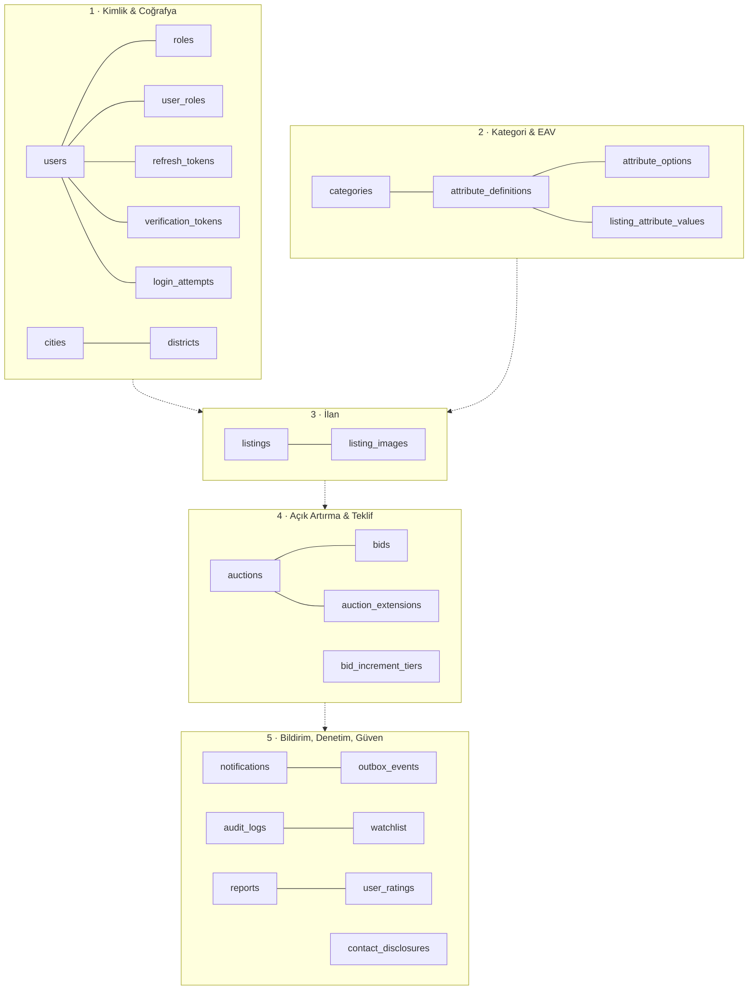
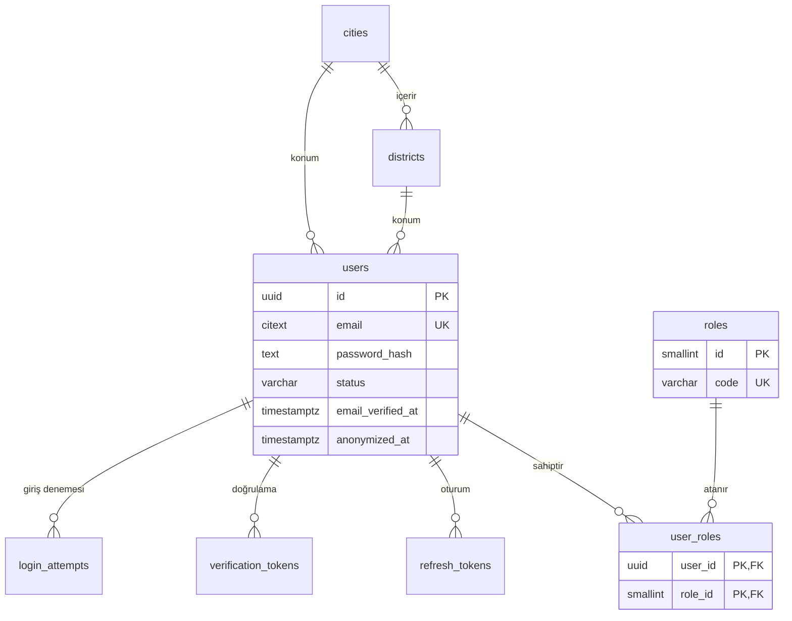
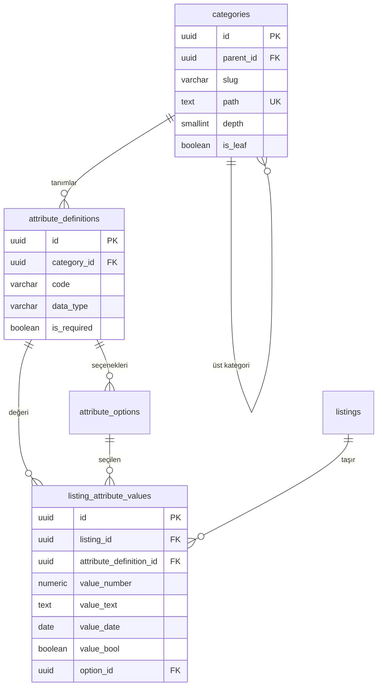
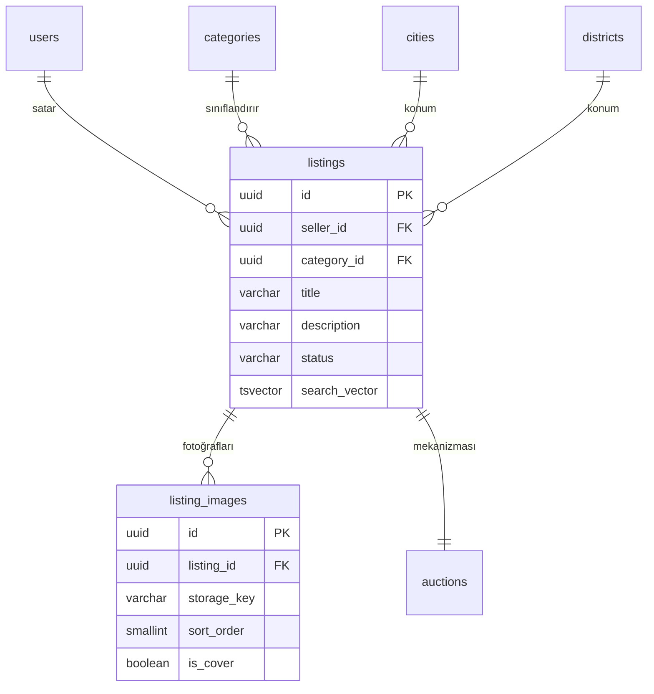
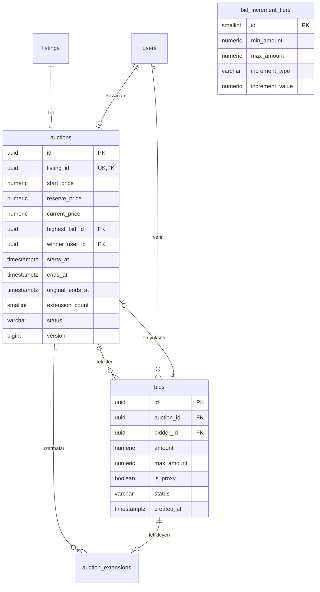
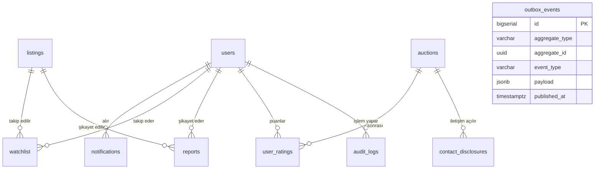

# TıklaSat — Veri Modeli ve ERD

| | |
|---|---|
| **Doküman** | Veri Modeli (Data Model) |
| **Sürüm** | 1.0 |
| **Tarih** | 2026-07-30 |
| **Veritabanı** | PostgreSQL 16 |
| **Girdi** | `docs/01-requirements/business-rules.md` v1.0 |
| **Çıktı** | `db/migration/V1__..V6__.sql` |

---

## İçindekiler

1. [Genel Bakış](#1-genel-bakış)
2. [Tasarım İlkeleri](#2-tasarım-i̇lkeleri)
3. [Alan 1 — Kimlik ve Coğrafya](#3-alan-1--kimlik-ve-coğrafya)
4. [Alan 2 — Kategori ve Dinamik Özellikler (EAV)](#4-alan-2--kategori-ve-dinamik-özellikler-eav)
5. [Alan 3 — İlan](#5-alan-3--i̇lan)
6. [Alan 4 — Açık Artırma ve Teklif](#6-alan-4--açık-artırma-ve-teklif)
7. [Alan 5 — Bildirim, Denetim, Güven](#7-alan-5--bildirim-denetim-güven)
8. [Index Stratejisi](#8-index-stratejisi)
9. [İzlenebilirlik Matrisi](#9-i̇zlenebilirlik-matrisi)

---

## 1. Genel Bakış

**25 tablo, 5 alan.** Tablolar iş alanlarına göre gruplanmıştır; migration dosyaları da bu gruplamayı izler.



> **Ayrıca:** `flyway_schema_history` (Flyway yönetir) ve `shedlock` (ShedLock yönetir) altyapı tablolarıdır; elle yazılmaz, 25'e dahil değildir.

---

## 2. Tasarım İlkeleri

Bu bölümdeki kararlar tüm tablolara uygulanır. Her birinin **neden**i, staj savunmasında sorulabilecek sorulardır.

### İ-1 · Birincil anahtar: UUID (v7)

Artan tamsayı yerine UUID kullanılır.

| Gerekçe | Açıklama |
|---|---|
| Bilgi sızdırmaz | `/ilan/1834` adresi rakibe toplam ilan sayısını söyler |
| Tahmin edilemez | Artan ID ile `/ilan/1835`, `/ilan/1836` denenerek içerik taranabilir |
| Önceden üretilebilir | Uygulama, veritabanına yazmadan ID'yi bilir → ilişkili kayıtlar tek transaction'da kurulur |

**Bedeli:** 16 bayt (integer 4). Rastgele UUID'ler index'te dağılma (page split) yaratır — bu yüzden **UUIDv7** kullanılır: zaman sıralı olduğu için index'e ardışık yazar, rastgele UUID'nin performans cezasını taşımaz.

**İstisna:** `login_attempts`, `outbox_events`, `audit_logs` ve referans tabloları (`roles`, `cities`, `districts`, `bid_increment_tiers`) **artan tamsayı** kullanır. Gerekçe: bunlar URL'de asla görünmez, dışarıya sızmaz ve `outbox_events` için **sıra numarası bizzat gereklidir** (olaylar üretildikleri sırayla yayınlanmalıdır).

### İ-2 · Para: `NUMERIC(15,2)`

`FLOAT`/`DOUBLE` **kesinlikle kullanılmaz.** Kayan nokta aritmetiğinde `0.1 + 0.2 ≠ 0.3`'tür; para hesabında bu kabul edilemez. Java tarafında karşılığı `BigDecimal`'dir, `double` değil.

`15,2` → 9.999.999.999.999,99 TL'ye kadar. Fazlasıyla yeterli.

`currency CHAR(3)` kolonu v1'de hep `'TRY'` olacak; **şimdi eklenmesinin sebebi**, ileride çoklu para birimi gerekirse tüm parasal tabloları migrate etmek zorunda kalmamaktır.

### İ-3 · Zaman: `TIMESTAMPTZ`, UTC

Tüm zamanlar `TIMESTAMPTZ` tipinde ve UTC olarak saklanır. JVM `-Duser.timezone=UTC` ile başlatılır. Yerel saate çeviri **yalnızca sunum katmanında** yapılır.

**Neden:** Yaz saati geçişinde yerel saat ya bir saat atlar ya bir saati iki kez yaşar. Yerel saatle saklanan bir açık artırma o gece yanlış zamanda biter. UTC'de böyle bir süreksizlik yoktur.

### İ-4 · Enum'lar: `VARCHAR` + `CHECK`

Durum alanları PostgreSQL'in `ENUM` tipiyle değil, `VARCHAR` + `CHECK` kısıtıyla modellenir.

**Neden:** PostgreSQL `ENUM`'una yeni değer eklemek şemayı kilitleyen bir işlemdir ve **değer silmek imkânsızdır**. `CHECK` kısıtı ise sıradan bir migration ile güncellenir. Java tarafında `@Enumerated(EnumType.STRING)` ile eşleşir — `EnumType.ORDINAL` **kullanılmaz**, çünkü enum sırası değişirse tüm geçmiş veri sessizce bozulur.

### İ-5 · Denetim kolonları

Her iş tablosunda `created_at` ve `updated_at` bulunur. Sık güncellenen tablolarda (`users`, `listings`, `auctions`) ayrıca `version BIGINT` — JPA'nın optimistik kilit alanı.

### İ-6 · Silme politikası

| Tablo | Politika |
|---|---|
| `users` | Anonimleştirme (`anonymized_at` + alan maskeleme) — `BR-K-003` |
| `listings` | `ARCHIVED` durumu — `BR-L-011` |
| `bids` | **Hiçbir koşulda silinmez.** `VOIDED` statüsü — `BR-B-005` |
| `categories` | `is_active = false` — `BR-C-007` |
| Denetim/log | Zaman aşımına göre otomatik temizlik — `BR-K-005` |

### İ-7 · İş kuralları veritabanında da zorlanır

Bir iş kuralı `CHECK`, `UNIQUE`, `FOREIGN KEY` veya `EXCLUDE` ile ifade edilebiliyorsa **veritabanına yazılır** — sadece Java'ya bırakılmaz.

**Neden:** Uygulama kodu hata yapabilir, elle SQL çalıştırılabilir, ileride ikinci bir servis yazılabilir. Veritabanı **son savunma hattıdır** ve hiçbir yol onu atlayamaz.

### İ-8 · İsimlendirme

| Nesne | Kural | Örnek |
|---|---|---|
| Tablo | `snake_case`, **çoğul** | `listing_images` |
| Kolon | `snake_case`, tekil | `created_at` |
| Yabancı anahtar | `<tablo_tekil>_id` | `seller_id`, `auction_id` |
| Index | `ix_<tablo>_<kolonlar>` | `ix_bids_auction_amount` |
| Benzersizlik | `uq_<tablo>_<kolonlar>` | `uq_bids_auction_amount` |
| CHECK | `ck_<tablo>_<kural>` | `ck_listings_title_length` |
| Yabancı anahtar kısıtı | `fk_<tablo>_<hedef>` | `fk_listings_seller` |

---

## 3. Alan 1 — Kimlik ve Coğrafya



### `users`

| Kolon | Tip | Null | Açıklama |
|---|---|---|---|
| `id` | `UUID` | ✗ | PK (UUIDv7) |
| `email` | `CITEXT` | ✗ | **UK** · `CITEXT` büyük/küçük harf duyarsız karşılaştırır → `BR-U-001` |
| `password_hash` | `TEXT` | ✗ | Argon2id çıktısı (parametreleri de içerir) → `BR-S-001` |
| `password_algo` | `VARCHAR(20)` | ✗ | Varsayılan `ARGON2ID`. Gelecekte algoritma geçişi için |
| `full_name` | `VARCHAR(100)` | ✗ | |
| `phone` | `VARCHAR(20)` | ✓ | E.164 formatı |
| `email_verified_at` | `TIMESTAMPTZ` | ✓ | `NULL` = doğrulanmamış → `BR-U-004` |
| `phone_verified_at` | `TIMESTAMPTZ` | ✓ | → `BR-U-005` |
| `status` | `VARCHAR(24)` | ✗ | `PENDING_VERIFICATION` \| `ACTIVE` \| `SUSPENDED` \| `BANNED` \| `ANONYMIZED` → `BR-U-007` |
| `city_id` | `SMALLINT` | ✓ | FK → `cities` |
| `district_id` | `INTEGER` | ✓ | FK → `districts` |
| `rating_avg` | `NUMERIC(3,2)` | ✓ | Denormalize ortalama puan (0.00–5.00) |
| `rating_count` | `INTEGER` | ✗ | Denormalize puan sayısı |
| `consent_version` | `VARCHAR(10)` | ✓ | KVKK rıza metni sürümü → `BR-K-006` |
| `consent_at` | `TIMESTAMPTZ` | ✓ | Rızanın alındığı an |
| `consent_ip` | `INET` | ✓ | Rızanın alındığı IP |
| `anonymized_at` | `TIMESTAMPTZ` | ✓ | Dolu ise kişisel alanlar maskelenmiştir → `BR-K-003` |
| `created_at` / `updated_at` | `TIMESTAMPTZ` | ✗ | |
| `version` | `BIGINT` | ✗ | Optimistik kilit |

**Kısıtlar**
- `ck_users_status` — durum listesi
- `ck_users_rating` — `rating_avg BETWEEN 0 AND 5`, `rating_count >= 0`
- `ck_users_anonymized` — anonimse `phone IS NULL` (maskeleme gerçekten uygulandı mı?)

> **Neden `rating_avg` ve `rating_count` burada duruyor?** Bunlar `user_ratings` tablosundan hesaplanabilir — yani **kasıtlı denormalizasyondur**. Her ilan listesinde satıcının puanı gösterilir; bunu her seferinde `AVG()` ile hesaplamak arama sorgusuna gereksiz bir birleştirme (join) ve toplama (aggregate) ekler. Değer, yeni puan eklendiğinde güncellenir. **Denormalizasyon her zaman bir bakım borcudur** — burada bilinçli alınmıştır ve tek yazma noktası vardır.

---

### `roles` · `user_roles`

`roles` sabit bir referans tablosudur; 4 satır seed edilir.

| Kolon | Tip | Açıklama |
|---|---|---|
| `id` | `SMALLINT` PK | 1–4, sabit |
| `code` | `VARCHAR(20)` UK | `BUYER` \| `SELLER` \| `ADMIN` \| `MODERATOR` |
| `name` | `VARCHAR(50)` | Türkçe görünen ad |

`user_roles` — çoktan-çoğa bağlantı tablosu (`BR-U-003`):

| Kolon | Tip | Açıklama |
|---|---|---|
| `user_id` | `UUID` | PK bileşeni, FK → `users` `ON DELETE CASCADE` |
| `role_id` | `SMALLINT` | PK bileşeni, FK → `roles` `ON DELETE RESTRICT` |
| `granted_at` | `TIMESTAMPTZ` | |
| `granted_by` | `UUID` | FK → `users` (kim atadı) |

> **`ZİYARETÇİ` neden yok?** Kimlik doğrulaması yapılmamış istektir, veri değildir → `BR-U-002`. Spring Security'de `permitAll()` ile ifade edilir.

---

### `refresh_tokens`

| Kolon | Tip | Açıklama |
|---|---|---|
| `id` | `UUID` PK | |
| `user_id` | `UUID` | FK → `users` |
| `token_hash` | `CHAR(64)` | **UK** · SHA-256 hex. **Token'ın kendisi saklanmaz** |
| `issued_at` / `expires_at` | `TIMESTAMPTZ` | |
| `revoked_at` | `TIMESTAMPTZ` | Dolu ise geçersiz |
| `replaced_by_id` | `UUID` | Self-FK — rotasyon zinciri |
| `user_agent` | `VARCHAR(255)` | |
| `ip_address` | `INET` | |

> **Neden hash saklanıyor?** Veritabanı sızarsa saldırgan token'ları **doğrudan kullanamaz**. Parolayı hashlemenin aynı mantığı.
>
> **`replaced_by_id` ne işe yarar?** Rotasyon zincirini kurar. Zaten kullanılmış (rotate edilmiş) bir token tekrar sunulursa, token çalınmış demektir → o zincirdeki tüm oturumlar kapatılır (`BR-S-008`).

---

### `verification_tokens` · `login_attempts`

`verification_tokens` — tek tablo, `purpose` ile ayrışır:

| Kolon | Tip | Açıklama |
|---|---|---|
| `id` | `UUID` PK | |
| `user_id` | `UUID` | FK → `users` |
| `purpose` | `VARCHAR(24)` | `EMAIL_VERIFICATION` \| `PASSWORD_RESET` \| `PHONE_VERIFICATION` |
| `token_hash` | `CHAR(64)` | UK |
| `expires_at` | `TIMESTAMPTZ` | E-posta doğrulaması 24 saat → `BR-U-004` |
| `consumed_at` | `TIMESTAMPTZ` | Tek kullanımlık |

`login_attempts` — kaba kuvvet tespiti (`BR-S-003`):

| Kolon | Tip | Açıklama |
|---|---|---|
| `id` | `BIGSERIAL` PK | Yüksek hacim, URL'de görünmez |
| `email` | `CITEXT` | Var olmayan hesaba denemeler de kaydedilir |
| `user_id` | `UUID` | FK, `NULL` olabilir |
| `ip_address` | `INET` | |
| `successful` | `BOOLEAN` | |
| `attempted_at` | `TIMESTAMPTZ` | |

> IP adresi kişisel veridir → 6 ay sonra temizlenir (`BR-K-005`).

---

### `cities` · `districts`

Türkiye'nin 81 ili ve ilçeleri. Statik referans veri, `V6` içinde seed edilir.

| `cities` | Tip | Açıklama |
|---|---|---|
| `id` | `SMALLINT` PK | Plaka kodu (1–81) |
| `name` | `VARCHAR(50)` | UK |

| `districts` | Tip | Açıklama |
|---|---|---|
| `id` | `INTEGER` PK | |
| `city_id` | `SMALLINT` | FK → `cities` |
| `name` | `VARCHAR(60)` | `UNIQUE(city_id, name)` |

> **Neden serbest metin değil?** "İstanbul", "istanbul", "İSTANBUL", "Istanbul" aynı yer olmalı. Serbest metin bırakılırsa filtreleme çalışmaz ve veri günden güne kirlenir.

---

## 4. Alan 2 — Kategori ve Dinamik Özellikler (EAV)

Bu alan, "sahibinden.com gibi" olmanın teknik karşılığıdır: her kategorinin **kendi alanları** olur ve yeni kategori eklemek **kod değişikliği gerektirmez** (`BR-C-003`).



### `categories`

| Kolon | Tip | Null | Açıklama |
|---|---|---|---|
| `id` | `UUID` | ✗ | PK |
| `parent_id` | `UUID` | ✓ | Self-FK. `NULL` = kök kategori |
| `name` | `VARCHAR(80)` | ✗ | "Otomobil" |
| `slug` | `VARCHAR(80)` | ✗ | "otomobil" — URL parçası |
| `path` | `TEXT` | ✗ | **UK** · `/vasita/otomobil/sedan/` |
| `depth` | `SMALLINT` | ✗ | 1–4 → `BR-C-001` |
| `is_leaf` | `BOOLEAN` | ✗ | Yalnızca `true` olanlara ilan açılır → `BR-C-002` |
| `sort_order` | `INTEGER` | ✗ | Menü sırası |
| `is_active` | `BOOLEAN` | ✗ | Pasife alma → `BR-C-007` |

**Kısıtlar**
- `ck_categories_depth` — `depth BETWEEN 1 AND 4`
- `uq_categories_path` — `path` global benzersiz
- `uq_categories_parent_slug` — `UNIQUE NULLS NOT DISTINCT (parent_id, slug)`

> **`NULLS NOT DISTINCT` nedir?** PostgreSQL varsayılan olarak `NULL`'ları birbirinden farklı sayar — yani `(NULL, 'vasita')` iki kez eklenebilirdi ve iki kök kategori aynı slug'a sahip olurdu. PostgreSQL 15+ ile gelen `NULLS NOT DISTINCT` bunu engeller. (Kullandığımız sürüm 16.)

**`path` neden var?** "Vasıta ve tüm alt kategorilerindeki ilanlar" sorgusu, yinelemeli sorgu (`WITH RECURSIVE`) yerine tek satırda çözülür:

```sql
SELECT * FROM listings l
  JOIN categories c ON c.id = l.category_id
 WHERE c.path LIKE '/vasita/%';   -- ix_categories_path (text_pattern_ops) kullanır
```

**Bedeli:** Bir kategori taşınırsa alt ağacın tüm `path` değerleri güncellenmelidir. Kategori taşıma nadir bir yönetim işlemidir; her arama sorgusunda yinelemeli sorgu çalıştırmaktan **çok** daha ucuzdur.

---

### `attribute_definitions`

Bir kategorinin hangi alanları sorduğunu tanımlar.

| Kolon | Tip | Null | Açıklama |
|---|---|---|---|
| `id` | `UUID` | ✗ | PK |
| `category_id` | `UUID` | ✗ | FK → `categories` |
| `code` | `VARCHAR(50)` | ✗ | `mileage_km` — `UNIQUE(category_id, code)` |
| `label` | `VARCHAR(80)` | ✗ | "Kilometre" — ekranda görünen |
| `data_type` | `VARCHAR(16)` | ✗ | `TEXT` \| `INTEGER` \| `DECIMAL` \| `BOOLEAN` \| `DATE` \| `ENUM` → `BR-C-005` |
| `unit` | `VARCHAR(16)` | ✓ | "km", "m²" |
| `is_required` | `BOOLEAN` | ✗ | → `BR-C-004` |
| `is_filterable` | `BOOLEAN` | ✗ | Arama filtresinde çıksın mı |
| `min_value` / `max_value` | `NUMERIC(18,4)` | ✓ | Sayısal doğrulama (model yılı 1900–2027 gibi) |
| `max_length` | `INTEGER` | ✓ | `TEXT` için |
| `sort_order` | `INTEGER` | ✗ | Formdaki sıra |
| `is_active` | `BOOLEAN` | ✗ | |

### `attribute_options`

Yalnızca `data_type = 'ENUM'` olan tanımlar için seçenek listesi (Yakıt → Benzin/Dizel/LPG/Elektrik).

| Kolon | Tip | Açıklama |
|---|---|---|
| `id` | `UUID` PK | |
| `attribute_definition_id` | `UUID` | FK |
| `value` | `VARCHAR(60)` | `UNIQUE(attribute_definition_id, value)` |
| `label` | `VARCHAR(80)` | |
| `sort_order` | `INTEGER` | |

---

### `listing_attribute_values` — EAV'ın kalbi

| Kolon | Tip | Null | Açıklama |
|---|---|---|---|
| `id` | `UUID` | ✗ | PK |
| `listing_id` | `UUID` | ✗ | FK → `listings` `ON DELETE CASCADE` |
| `attribute_definition_id` | `UUID` | ✗ | FK → `attribute_definitions` |
| `value_text` | `TEXT` | ✓ | |
| `value_number` | `NUMERIC(18,4)` | ✓ | `INTEGER` ve `DECIMAL` buraya |
| `value_bool` | `BOOLEAN` | ✓ | |
| `value_date` | `DATE` | ✓ | |
| `option_id` | `UUID` | ✓ | FK → `attribute_options` (`ENUM` için) |

**Kısıtlar**
- `uq_lav_listing_attr` — `UNIQUE(listing_id, attribute_definition_id)` · bir ilanın bir alanı bir kez olur
- `ck_lav_exactly_one_value` — `num_nonnulls(value_text, value_number, value_bool, value_date, option_id) = 1`

> ### Bu tasarımın can alıcı noktası: tipli kolonlar
>
> Klasik EAV, tüm değerleri **tek bir `value TEXT` kolonunda** saklar. Bu, EAV'ın kötü şöhretinin asıl sebebidir:
>
> ```sql
> -- ❌ Tek text kolonu ile: "100.000-200.000 km arası" sorgusu
> WHERE CAST(value AS NUMERIC) BETWEEN 100000 AND 200000
> ```
>
> `CAST` çağrısı index'i **kullanılamaz** hale getirir → her arama tüm tabloyu tarar (Seq Scan). Üstelik tek bir bozuk satır (`value = 'yok'`) tüm sorguyu çalışma zamanında patlatır.
>
> ```sql
> -- ✅ Tipli kolon ile
> WHERE value_number BETWEEN 100000 AND 200000
> ```
>
> `ix_lav_number` index'i doğrudan çalışır (Index Scan) ve `NUMERIC` kolona sayı olmayan değer **zaten girilemez**.
>
> **`ck_lav_exactly_one_value` neden şart?** Beş değer kolonundan tam olarak birinin dolu olmasını garanti eder. Olmasaydı hem `value_text='120000'` hem `value_number=120000` yazan bir satır oluşabilir, ikisi zamanla birbirinden ayrışır ve hangisinin doğru olduğu bilinemezdi. PostgreSQL'in `num_nonnulls()` fonksiyonu bunu tek satırda ifade eder.

---

## 5. Alan 3 — İlan



### `listings`

| Kolon | Tip | Null | Açıklama |
|---|---|---|---|
| `id` | `UUID` | ✗ | PK |
| `seller_id` | `UUID` | ✗ | FK → `users` `ON DELETE RESTRICT` |
| `category_id` | `UUID` | ✗ | FK → `categories` (yaprak olmalı → `BR-C-002`) |
| `title` | `VARCHAR(70)` | ✗ | → `BR-L-001` |
| `description` | `VARCHAR(3000)` | ✗ | → `BR-L-002` |
| `city_id` / `district_id` | `SMALLINT`/`INTEGER` | ✗ | → `BR-L-005` |
| `status` | `VARCHAR(20)` | ✗ | `DRAFT` \| `PENDING_REVIEW` \| `APPROVED` \| `REJECTED` \| `ARCHIVED` → `BR-L-006` |
| `moderated_by` | `UUID` | ✓ | FK → `users` |
| `moderated_at` | `TIMESTAMPTZ` | ✓ | |
| `moderation_note` | `VARCHAR(500)` | ✓ | Ret gerekçesi → `BR-L-007` |
| `published_at` | `TIMESTAMPTZ` | ✓ | |
| `view_count` | `INTEGER` | ✗ | Görüntülenme |
| `search_vector` | `TSVECTOR` | ✗ | **Üretilmiş kolon** — aşağıya bakınız |
| `created_at` / `updated_at` | `TIMESTAMPTZ` | ✗ | |
| `version` | `BIGINT` | ✗ | |

**Kısıtlar**
- `ck_listings_title_length` — `char_length(title) BETWEEN 10 AND 70` → `BR-L-001`
- `ck_listings_description_length` — `char_length(description) <= 3000` → `BR-L-002`
- `ck_listings_status` — durum listesi
- `ck_listings_moderation` — `REJECTED` ise `moderation_note` dolu olmalı

**Tam metin arama** (`BR-L-010`) — `search_vector` **üretilmiş kolondur** (generated column):

```sql
search_vector TSVECTOR GENERATED ALWAYS AS (
    setweight(to_tsvector('turkish', coalesce(title, '')),       'A') ||
    setweight(to_tsvector('turkish', coalesce(description, '')), 'B')
) STORED
```

> **`GENERATED ALWAYS ... STORED` ne demek?** Kolonu PostgreSQL **kendisi** hesaplar ve saklar; `title` her değiştiğinde otomatik tazelenir. Uygulama kodunun bu kolonu güncellemesi ne gerekir ne de mümkündür — dolayısıyla "arama index'ini güncellemeyi unuttum" hatası **yapısal olarak imkânsızdır**. Trigger yazmaya da gerek kalmaz.
>
> **`setweight` neden?** Başlıktaki eşleşme (`'A'`) açıklamadaki eşleşmeden (`'B'`) daha değerlidir; `ts_rank` sıralamayı buna göre yapar.
>
> **`'turkish'`** PostgreSQL'in yerleşik Türkçe kök bulma (snowball) yapılandırmasıdır; ek eklenmiş kelimeleri ("arabalar", "arabayı") aynı köke indirger.

---

### `listing_images`

| Kolon | Tip | Null | Açıklama |
|---|---|---|---|
| `id` | `UUID` | ✗ | PK |
| `listing_id` | `UUID` | ✗ | FK `ON DELETE CASCADE` |
| `storage_key` | `VARCHAR(255)` | ✗ | Nesne deposundaki yol. **Görsel veritabanında saklanmaz** |
| `content_type` | `VARCHAR(50)` | ✗ | `image/jpeg` \| `image/png` \| `image/webp` |
| `size_bytes` | `INTEGER` | ✗ | ≤ 5.242.880 → `BR-L-003` |
| `width` / `height` | `INTEGER` | ✗ | Düzen kaymasını (layout shift) önlemek için |
| `sort_order` | `SMALLINT` | ✗ | 0–14 → en fazla 15 fotoğraf |
| `is_cover` | `BOOLEAN` | ✗ | → `BR-L-004` |

**Kısıtlar**
- `uq_listing_images_order` — `UNIQUE(listing_id, sort_order)`
- `ck_listing_images_order` — `sort_order BETWEEN 0 AND 14`
- `ck_listing_images_size` — `size_bytes BETWEEN 1 AND 5242880`
- `ck_listing_images_type` — izinli MIME listesi
- `uq_listing_images_single_cover` — **kısmi benzersiz index:**
  ```sql
  CREATE UNIQUE INDEX uq_listing_images_single_cover
      ON listing_images (listing_id) WHERE is_cover;
  ```

> **Kısmi index (partial index) hilesi:** `WHERE is_cover` sayesinde index'e yalnızca kapak fotoğrafları girer. Bir ilan için ikinci bir kapak eklenmeye çalışılırsa benzersizlik ihlali olur. Böylece **"her ilanın en fazla bir kapağı olur"** kuralı veritabanı seviyesinde, trigger yazmadan garanti edilir.
>
> ⚠️ **Bilinçli istisna:** Fotoğraf sayısının **alt sınırı** (en az 1) tek satırlık bir `CHECK` ile ifade edilemez — bir satırın kısıtı, kardeş satırların sayısını göremez. Trigger ile yapılabilirdi ancak trigger'lar ilan oluşturma akışında görünmez yan etkiler üretir ve hata ayıklamayı zorlaştırır. **Karar:** alt sınır servis katmanında doğrulanır ve bu istisna burada kayda geçirilmiştir. Üst sınır (15) ise `sort_order` aralığıyla zaten veritabanında garantidir.

---

## 6. Alan 4 — Açık Artırma ve Teklif

> Projenin **sıcak yolu** (hot path) burasıdır. Bu alandaki her karar eşzamanlılık davranışını doğrudan etkiler. Ayrıntılı akış: `docs/02-design/concurrency-design.md`



### 6.0 Neden `listings` ve `auctions` ayrı tablolar?

Bu 1—1 ilişki, projenin en çok sorgulanacak tasarım kararıdır. Gerekçesi **performans değil, kilit çekişmesidir**:

| | `listings` | `auctions` |
|---|---|---|
| **Sıcaklık** | Soğuk | **Sıcak** |
| Yazma sıklığı | İlan oluşturma/düzenleme (nadir) | **Her teklifte** |
| Satır genişliği | Geniş (3000 karakterlik açıklama + tsvector) | Dar (sayılar ve zamanlar) |

PostgreSQL bir satırı güncellerken (MVCC gereği) **satırın tamamının yeni bir sürümünü yazar** — sadece değişen kolonu değil. Tek tabloda birleştirilseydi, her teklif 3000 karakterlik açıklamayı ve tsvector'ü de yeniden yazardı.

Somut sonuçlar:
1. **Kilit süresi kısalır.** `FOR UPDATE` ile kilitlenen satır dar olduğu için transaction daha hızlı biter → sıradaki teklif daha erken işlenir.
2. **Disk yazımı azalır.** Son saniyelerde saniyede onlarca teklif geldiğinde fark belirginleşir.
3. **Index bakımı azalır.** `listings.search_vector` üzerindeki GIN index'i teklif başına dokunulmaz.

Ek fayda: ilan içeriği (moderasyon alanı) ile fiyat mekanizması (ticaret alanı) kavramsal olarak da ayrışır. → `ADR-0003`

---

### `auctions`

| Kolon | Tip | Null | Açıklama |
|---|---|---|---|
| `id` | `UUID` | ✗ | PK |
| `listing_id` | `UUID` | ✗ | **UK** — 1—1 ilişkiyi kuran kısıt → `BR-A-001` |
| `start_price` | `NUMERIC(15,2)` | ✗ | → `BR-A-002` |
| `reserve_price` | `NUMERIC(15,2)` | ✓ | **Gizli** taban → `BR-A-003` |
| `current_price` | `NUMERIC(15,2)` | ✗ | Teklif yoksa `start_price`'a eşit |
| `currency` | `CHAR(3)` | ✗ | `TRY` |
| `bid_count` | `INTEGER` | ✗ | Denormalize sayaç |
| `highest_bid_id` | `UUID` | ✓ | FK → `bids` (**döngüsel**, aşağıya bakınız) |
| `winner_user_id` | `UUID` | ✓ | Kapanışta doldurulur → `BR-A-008` |
| `starts_at` | `TIMESTAMPTZ` | ✗ | |
| `ends_at` | `TIMESTAMPTZ` | ✗ | **Değişkendir** — sniper koruması günceller |
| `original_ends_at` | `TIMESTAMPTZ` | ✗ | **Değişmez** — süre ve tavan denetimi buna göre |
| `extension_count` | `SMALLINT` | ✗ | 0–20 → `BR-A-006` |
| `status` | `VARCHAR(28)` | ✗ | 6 durum → `BR-A-005` |
| `closed_at` | `TIMESTAMPTZ` | ✓ | |
| `cancelled_by` | `UUID` | ✓ | FK → `users` → `BR-A-012` |
| `cancellation_reason` | `VARCHAR(500)` | ✓ | |
| `version` | `BIGINT` | ✗ | Optimistik kilit (ikinci savunma ağı) |
| `created_at` / `updated_at` | `TIMESTAMPTZ` | ✗ | |

**Kısıtlar — iş kurallarının veritabanı karşılıkları**

| Kısıt | İfade | Kural |
|---|---|---|
| `ck_auctions_start_price` | `start_price > 0` | `BR-A-002` |
| `ck_auctions_reserve` | `reserve_price IS NULL OR reserve_price >= start_price` | `BR-A-003` |
| `ck_auctions_current_price` | `current_price >= start_price` | `BR-B-003` |
| `ck_auctions_time_order` | `ends_at > starts_at` | — |
| `ck_auctions_duration` | `original_ends_at - starts_at BETWEEN INTERVAL '1 hour' AND INTERVAL '14 days'` | `BR-A-004` |
| `ck_auctions_extension_window` | `ends_at >= original_ends_at AND ends_at <= original_ends_at + INTERVAL '60 minutes'` | `BR-A-006` |
| `ck_auctions_extension_count` | `extension_count BETWEEN 0 AND 20` | `BR-A-006` |
| `ck_auctions_winner_consistency` | `status='ENDED_SOLD'` ⟺ `winner_user_id IS NOT NULL` | `BR-A-008` |
| `ck_auctions_cancellation` | `status='CANCELLED'` ⟹ `cancellation_reason IS NOT NULL` | `BR-A-012` |

> **`ck_auctions_extension_window` neden özel?** Sniper korumasının 60 dakikalık **mutlak** tavanını veritabanı seviyesinde garanti eder. Kodda bir hata olsa, birisi elle `UPDATE` çalıştırsa bile bir açık artırma orijinal bitişinden 60 dakikadan fazla uzayamaz. "Sonsuza kadar uzayan artırma" senaryosu yapısal olarak imkânsız hale gelir.
>
> ⚠️ **Bu 60 dakika, `ck_auctions_extension_count` (max 20) ile eşit ağırlıkta iki tavan değildir.** `şimdi + 120sn` formülünde her uzatma en fazla ~120 saniye ekler; 20 uzatma en iyimser senaryoda bile toplamda ancak ~40 dakikaya ulaşır. Yani **20'lik sayaç pratikte her zaman önce dolar** ve 60 dakikalık kısıt bugünkü parametrelerle hiç tetiklenmez — yalnızca pencere/uzatma süresi ileride büyütülürse diye konmuş bağımsız bir alt güvenlik ağıdır (`ADR-0006`).
>
> **`ck_auctions_duration` neden `original_ends_at` üzerinde?** `ends_at` uzatmalarla kayar; 14 günlük bir artırma uzatmalarla 14 gün + 60 dakikaya çıkabilir. Süre sınırı satıcının **seçtiği** süreye uygulanmalıdır, uzatılmış haline değil.

**Döngüsel yabancı anahtar:** `auctions.highest_bid_id → bids.id` ve `bids.auction_id → auctions.id` birbirine işaret eder. Çözüm: `bids` tablosu oluşturulduktan **sonra** `ALTER TABLE auctions ADD CONSTRAINT fk_auctions_highest_bid ...` ile kısıt eklenir. Migration sırası bu yüzden önemlidir.

> **`highest_bid_id` neden var — `MAX(amount)` ile bulunamaz mı?** Bulunabilir, ama bu da bilinçli bir denormalizasyondur. Ana ilan sayfası her açılışta güncel en yüksek teklifi gösterir; bunu `bids` üzerinde toplama sorgusuyla bulmak, zaten kilitlediğimiz `auctions` satırından okumaya göre çok daha pahalıdır. Değer, teklif kabul transaction'ının **içinde** güncellenir — yani tutarsız kalması mümkün değildir.

---

### `bids`

| Kolon | Tip | Null | Açıklama |
|---|---|---|---|
| `id` | `UUID` | ✗ | PK |
| `auction_id` | `UUID` | ✗ | FK → `auctions` `ON DELETE RESTRICT` |
| `bidder_id` | `UUID` | ✗ | FK → `users` `ON DELETE RESTRICT` |
| `amount` | `NUMERIC(15,2)` | ✗ | Teklif tutarı |
| `max_amount` | `NUMERIC(15,2)` | ✓ | **v1'de her zaman `NULL`** — vekil teklif için hazır → `BR-B-013` |
| `is_proxy` | `BOOLEAN` | ✗ | **v1'de her zaman `false`** |
| `status` | `VARCHAR(12)` | ✗ | `WINNING` \| `OUTBID` \| `WON` \| `LOST` \| `VOIDED` |
| `ip_address` | `INET` | ✓ | → `BR-B-012` |
| `user_agent` | `VARCHAR(255)` | ✓ | |
| `created_at` | `TIMESTAMPTZ` | ✗ | |
| `voided_by` | `UUID` | ✓ | FK → `users` |
| `voided_at` | `TIMESTAMPTZ` | ✓ | |
| `void_reason` | `VARCHAR(500)` | ✓ | |

**Kısıtlar**

| Kısıt | İfade | Kural |
|---|---|---|
| `uq_bids_auction_amount` | `UNIQUE(auction_id, amount)` | `BR-B-004` |
| `ck_bids_amount_positive` | `amount > 0` | — |
| `ck_bids_max_amount` | `max_amount IS NULL OR max_amount >= amount` | `BR-B-013` |
| `ck_bids_status` | Durum listesi | — |
| `ck_bids_void_consistency` | `status='VOIDED'` ⟺ `voided_at IS NOT NULL AND void_reason IS NOT NULL` | `BR-B-005` |

> ### `uq_bids_auction_amount` — üç savunma katmanının ikincisi
>
> Bu basit görünen kısıt aslında bir **eşzamanlılık savunmasıdır**. Kilitleme mantığında bir hata olsa ve iki teklif aynı anda `current_price = 1000` görüp ikisi de `1100` yazmaya kalksa, veritabanı ikincisini **reddeder**. `INSERT` sırasında benzersizlik kontrolü PostgreSQL'de atomiktir; hiçbir yarış koşulu bunu atlatamaz.
>
> Yani kilit mekanizması "kaybolan güncellemeyi" engeller; bu kısıt ise **kilit mekanizmasının kendisi hatalıysa** devreye girer. Kritik sistemlerde savunmanın tek katmana bırakılmaması ilkesinin somut uygulamasıdır.

> ### `bids` neden append-only?
>
> `UPDATE bids SET amount = ...` **hiçbir koşulda çalıştırılmaz**; yalnızca `status` alanı değişir. Gerekçeler:
> - Verilen teklif **hukuken bağlayıcıdır** (`BR-B-005`); geçmişe dönük değiştirilmesi platformun güvenilirliğini ortadan kaldırır.
> - Değişmez kayıt, dolandırıcılık incelemesi için tek güvenilir kanıttır.
> - Append-only tablo, eşzamanlılık açısından da avantajlıdır: `INSERT` işlemleri birbirini kilitlemez.

---

### `bid_increment_tiers`

Teklif artış kademeleri (`BR-B-003`, §5.1).

| Kolon | Tip | Açıklama |
|---|---|---|
| `id` | `SMALLINT` PK | |
| `min_amount` | `NUMERIC(15,2)` | Dahil |
| `max_amount` | `NUMERIC(15,2)` | Hariç. `NULL` = sonsuz |
| `increment_type` | `VARCHAR(10)` | `FIXED` \| `PERCENTAGE` |
| `increment_value` | `NUMERIC(15,2)` | `FIXED` → TL · `PERCENTAGE` → yüzde |
| `is_active` | `BOOLEAN` | |

**Kısıtlar**
- `ck_tiers_range` — `max_amount IS NULL OR max_amount > min_amount`
- `ck_tiers_value` — `increment_value > 0`
- `ex_tiers_no_overlap` — **çakışma engelleme kısıtı:**

```sql
ALTER TABLE bid_increment_tiers ADD CONSTRAINT ex_tiers_no_overlap
    EXCLUDE USING gist (
        numrange(min_amount, COALESCE(max_amount, 'Infinity'::numeric), '[)') WITH &&
    ) WHERE (is_active);
```

> **`EXCLUDE` kısıtı nedir?** `UNIQUE`'in genelleştirilmiş hâli. `UNIQUE` "iki satır **eşit** olamaz" der; `EXCLUDE` ise istediğin operatörü kullanabilirsin: burada `&&` (aralıklar **kesişiyor**) operatörüyle *"iki aktif kademenin fiyat aralıkları kesişemez"* kuralı kurulur.
>
> Olmasaydı, yanlışlıkla `(0–1000, 25 TL)` ve `(500–2000, 100 TL)` kademeleri birlikte eklenebilir; 800 TL'lik bir fiyat **iki kademeye birden** düşer ve minimum teklif tutarı sorgunun döndürdüğü satırın sırasına göre değişirdi — yani sistem tutarsız davranırdı. Bu kısıt böyle bir veriyi baştan reddeder.
>
> `'[)'` işareti aralığın **alt sınırı dahil, üst sınırı hariç** olduğunu belirtir — §5.1'deki "tam 1.000 TL ikinci kademeye düşer" kuralının tam karşılığı.

---

### `auction_extensions`

Sniper koruması denetim kaydı (`BR-A-006`).

| Kolon | Tip | Açıklama |
|---|---|---|
| `id` | `UUID` PK | |
| `auction_id` | `UUID` | FK → `auctions` |
| `bid_id` | `UUID` | FK → `bids` · uzatmayı tetikleyen teklif |
| `extension_no` | `SMALLINT` | 1'den başlar · `UNIQUE(auction_id, extension_no)` |
| `previous_ends_at` | `TIMESTAMPTZ` | Uzatma öncesi |
| `new_ends_at` | `TIMESTAMPTZ` | Uzatma sonrası |
| `created_at` | `TIMESTAMPTZ` | |

> **Neden ayrı bir tablo?** `auctions.extension_count` sadece "kaç kez uzadı" der. Bir kullanıcı "artırma neden 20 dakika geç bitti?" diye itiraz ettiğinde, bu tablo her uzatmanın **hangi teklif yüzünden, ne zaman, hangi zamandan hangi zamana** yapıldığını satır satır gösterir. Şeffaflık, açık artırma platformunda güvenin temelidir.

---

## 7. Alan 5 — Bildirim, Denetim, Güven



### `outbox_events` — güvenilir bildirim köprüsü

| Kolon | Tip | Açıklama |
|---|---|---|
| `id` | `BIGSERIAL` PK | **Sıra numarası bilinçlidir** — olaylar üretim sırasıyla yayınlanır |
| `aggregate_type` | `VARCHAR(40)` | `AUCTION` \| `LISTING` \| `USER` |
| `aggregate_id` | `UUID` | İlgili kaydın kimliği |
| `event_type` | `VARCHAR(50)` | `BID_PLACED` \| `AUCTION_EXTENDED` \| `AUCTION_CLOSED` \| `USER_OUTBID` … |
| `payload` | `JSONB` | Olayın gövdesi |
| `created_at` | `TIMESTAMPTZ` | |
| `published_at` | `TIMESTAMPTZ` | `NULL` = henüz yayınlanmadı |
| `attempt_count` | `SMALLINT` | Yeniden deneme sayacı |
| `last_error` | `TEXT` | Son hata |

**Index:** `ix_outbox_unpublished ON outbox_events (id) WHERE published_at IS NULL`

> **Kısmi index'in değeri:** Yayıncı süreç sadece yayınlanmamış olayları sorgular. Tablo zamanla milyonlarca satıra çıksa bile, index yalnızca **bekleyen** olayları içerir — genelde birkaç düzine satır. Sorgu, tablo büyüklüğünden bağımsız olarak sabit hızda kalır.
>
> **Neden bu tablo var?** Teklif kabul edildiğinde WebSocket yayınını doğrudan yapmak iki şekilde bozulur:
> - Yayın gitti ama transaction geri alındı → herkes **var olmayan** bir teklif gördü.
> - Transaction başarılı ama yayın kayboldu → ekranlar **donuk** kaldı.
>
> Outbox satırı teklifle **aynı transaction'da** yazılır: teklif varsa olay da vardır, teklif yoksa olay da yoktur. Ayrı bir yayıncı süreç bu satırları okuyup gönderir ve `published_at`'i işaretler. Bildirim servisi çökse bile teklif kabulü etkilenmez (`BR-N-007`).

---

### `notifications`

| Kolon | Tip | Açıklama |
|---|---|---|
| `id` | `UUID` PK | |
| `user_id` | `UUID` | FK → `users` |
| `type` | `VARCHAR(32)` | `OUTBID` \| `AUCTION_WON` \| `AUCTION_SOLD` \| `LISTING_APPROVED` \| `LISTING_REJECTED` \| `ENDING_SOON` \| `AUCTION_CANCELLED` → `BR-N-001` |
| `title` | `VARCHAR(150)` | |
| `body` | `VARCHAR(500)` | |
| `payload` | `JSONB` | Derin bağlantı için ek veri |
| `listing_id` / `auction_id` | `UUID` | FK, `NULL` olabilir |
| `read_at` | `TIMESTAMPTZ` | |
| `created_at` | `TIMESTAMPTZ` | |

**Index:** `ix_notifications_unread ON notifications (user_id, created_at DESC) WHERE read_at IS NULL` — "okunmamış bildirim rozeti" sorgusu için kısmi index.

### `watchlist`

| Kolon | Tip | Açıklama |
|---|---|---|
| `user_id` | `UUID` | PK bileşeni, FK |
| `listing_id` | `UUID` | PK bileşeni, FK |
| `created_at` | `TIMESTAMPTZ` | |

Bileşik birincil anahtar; ayrı bir `id` kolonu gereksizdir → `BR-N-002`

### `audit_logs`

| Kolon | Tip | Açıklama |
|---|---|---|
| `id` | `BIGSERIAL` PK | |
| `actor_user_id` | `UUID` | FK, `NULL` = sistem |
| `action` | `VARCHAR(50)` | `ROLE_GRANTED` \| `LISTING_APPROVED` \| `AUCTION_CANCELLED` \| `BID_VOIDED` \| `USER_SUSPENDED` … |
| `entity_type` / `entity_id` | `VARCHAR(40)` / `UUID` | Hedef kayıt |
| `before_state` / `after_state` | `JSONB` | Değişiklik öncesi/sonrası |
| `ip_address` | `INET` | |
| `created_at` | `TIMESTAMPTZ` | |

→ `BR-S-006`. 2 yıl sonra temizlenir (`BR-K-005`).

### `reports`

| Kolon | Tip | Açıklama |
|---|---|---|
| `id` | `UUID` PK | |
| `reporter_id` / `listing_id` | `UUID` | FK · `UNIQUE(reporter_id, listing_id)` — kullanıcı başına tek şikayet |
| `reason_code` | `VARCHAR(32)` | `FAKE_LISTING` \| `PROHIBITED_ITEM` \| `MISLEADING_INFO` \| `OFFENSIVE_CONTENT` \| `SUSPECTED_FRAUD` \| `OTHER` |
| `description` | `VARCHAR(1000)` | |
| `status` | `VARCHAR(16)` | `OPEN` \| `IN_REVIEW` \| `RESOLVED` \| `DISMISSED` |
| `resolved_by` / `resolved_at` / `resolution_note` | | |

### `user_ratings`

| Kolon | Tip | Açıklama |
|---|---|---|
| `id` | `UUID` PK | |
| `auction_id` | `UUID` | FK · `UNIQUE(auction_id, rater_id)` — artırma başına tek puan |
| `rater_id` / `ratee_id` | `UUID` | FK · `CHECK (rater_id <> ratee_id)` |
| `score` | `SMALLINT` | `CHECK (score BETWEEN 1 AND 5)` |
| `comment` | `VARCHAR(500)` | |
| `created_at` | `TIMESTAMPTZ` | |

→ `BR-N-006`. 30 günlük pencere servis katmanında denetlenir (kapanış zamanına göre değiştiği için `CHECK`'e uygun değil).

### `contact_disclosures`

| Kolon | Tip | Açıklama |
|---|---|---|
| `id` | `UUID` PK | |
| `auction_id` | `UUID` | FK |
| `viewer_user_id` | `UUID` | FK · bilgiyi **gören** |
| `subject_user_id` | `UUID` | FK · bilgisi **açılan** |
| `disclosed_fields` | `VARCHAR(100)` | `PHONE,EMAIL` |
| `viewer_ip` | `INET` | |
| `disclosed_at` | `TIMESTAMPTZ` | |

`UNIQUE(auction_id, viewer_user_id, subject_user_id)` · `CHECK (viewer_user_id <> subject_user_id)`

> **KVKK karşılığı** (`BR-K-004`): Kullanıcı, kendi telefon numarasının **kime, ne zaman, hangi işlem nedeniyle** açıldığını sorgulayabilir. Kişisel veriyi paylaşan bir platformun bunu kayıt altına alması yasal bir gerekliliktir — ve teknik olarak da tek satırlık bir maliyettir.

---

## 8. Index Stratejisi

Her index bir sorguya hizmet eder. Hizmet etmeyen index **yazma maliyeti** demektir — her `INSERT`/`UPDATE` onu da güncellemek zorundadır. Bu yüzden liste kısa tutulmuştur.

### Sıcak yol (teklif verme) — kritik

| Index | Hizmet ettiği sorgu |
|---|---|
| `auctions` PK | `SELECT ... WHERE id = ? FOR UPDATE` — teklif yolunun ilk adımı |
| `ix_bids_auction_amount (auction_id, amount DESC)` | En yüksek teklif · teklif geçmişi sıralı listesi |
| `ix_bids_auction_created (auction_id, created_at DESC)` | "Son teklifler" akışı |
| `ix_bids_bidder (bidder_id, created_at DESC)` | "Tekliflerim" sayfası |
| `uq_bids_auction_amount` | Benzersizlik + en yüksek teklif aramasını da destekler |

### Kapatma işi

| Index | Hizmet ettiği sorgu |
|---|---|
| `ix_auctions_closing (ends_at) WHERE status = 'ACTIVE'` | `WHERE status='ACTIVE' AND ends_at <= now()` |

> **Kısmi index'in gücü:** Zamanla milyonlarca kapanmış artırma birikir. Index yalnızca **aktif** olanları içerdiği için, kapatma işinin sorgusu sistem büyüdükçe yavaşlamaz. Tam index kullanılsaydı, kapatma işi her turda giderek büyüyen bir yapıyı taramak zorunda kalırdı.

### Arama ve listeleme

| Index | Hizmet ettiği sorgu |
|---|---|
| `ix_listings_search GIN (search_vector)` | Tam metin arama → `BR-L-010` |
| `ix_listings_category_status (category_id, status, published_at DESC)` | Kategori sayfası |
| `ix_listings_location (city_id, district_id) WHERE status='APPROVED'` | Konum filtresi |
| `ix_listings_seller (seller_id, created_at DESC)` | "İlanlarım" |
| `ix_categories_path (path text_pattern_ops)` | `path LIKE '/vasita/%'` |

> **`text_pattern_ops` neden gerekli?** Varsayılan index, veritabanının dil sıralamasını (collation) kullanır ve `LIKE 'önek%'` sorgularında **kullanılamaz**. `text_pattern_ops` bayt sırasına göre index kurar ve önek aramasını index'e uygun hale getirir. Bu bilinmediği için birçok projede `LIKE` sorguları sessizce tam tablo taraması yapar.

### EAV filtreleri

| Index | Hizmet ettiği sorgu |
|---|---|
| `ix_lav_number (attribute_definition_id, value_number) WHERE value_number IS NOT NULL` | "100.000–200.000 km arası" |
| `ix_lav_option (attribute_definition_id, option_id) WHERE option_id IS NOT NULL` | "Yakıt = Dizel" |
| `ix_lav_listing (listing_id)` | İlan detayında tüm özellikleri getir |

> Kolon sırası önemlidir: önce `attribute_definition_id` (hangi alan), sonra değer. Ters sırada olsaydı, farklı alanların değerleri index'te iç içe geçer ve aralık taraması işe yaramazdı.

### Denetim ve bildirim

| Index | Hizmet ettiği sorgu |
|---|---|
| `ix_outbox_unpublished (id) WHERE published_at IS NULL` | Yayıncının döngü sorgusu |
| `ix_notifications_unread (user_id, created_at DESC) WHERE read_at IS NULL` | Okunmamış rozeti |
| `ix_audit_entity (entity_type, entity_id, created_at DESC)` | "Bu kayda ne oldu?" |
| `ix_login_attempts_ip (ip_address, attempted_at DESC)` | Kaba kuvvet tespiti |

---

## 9. İzlenebilirlik Matrisi

Her iş kuralının nerede uygulandığı. **Boş satır = uygulanmamış gereksinim.**

| Kural | Nerede uygulanıyor | Tip |
|---|---|---|
| `BR-U-001` | `users.email` `CITEXT UNIQUE` | 🗄️ DB |
| `BR-U-002` | `roles` seed — 4 satır, `VISITOR` yok | 🗄️ DB |
| `BR-U-003` | `user_roles` çoktan-çoğa | 🗄️ DB |
| `BR-U-004` | `users.email_verified_at` + servis kontrolü | 🗄️+⚙️ |
| `BR-U-006` | Parola politikası doğrulayıcı | ⚙️ Servis |
| `BR-U-007` | `ck_users_status` | 🗄️ DB |
| `BR-U-008` | `@PreAuthorize` + servis kuralı | ⚙️ Servis |
| `BR-C-001` | `ck_categories_depth` | 🗄️ DB |
| `BR-C-002` | `categories.is_leaf` + servis kontrolü | 🗄️+⚙️ |
| `BR-C-003` | `attribute_definitions` tablosu | 🗄️ DB |
| `BR-C-004` | `attribute_definitions.is_required` + doğrulayıcı | 🗄️+⚙️ |
| `BR-C-005` | `ck_attr_def_data_type` + tipli değer kolonları | 🗄️ DB |
| `BR-C-007` | `categories.is_active` + `ON DELETE RESTRICT` | 🗄️ DB |
| `BR-L-001` | `ck_listings_title_length` | 🗄️ DB |
| `BR-L-002` | `ck_listings_description_length` | 🗄️ DB |
| `BR-L-003` | `ck_listing_images_size`, `ck_listing_images_order` (üst sınır) + servis (alt sınır) | 🗄️+⚙️ |
| `BR-L-004` | `uq_listing_images_single_cover` (kısmi index) | 🗄️ DB |
| `BR-L-005` | `listings.city_id/district_id NOT NULL` | 🗄️ DB |
| `BR-L-006` | `ck_listings_status` | 🗄️ DB |
| `BR-L-007` | `ck_listings_moderation` | 🗄️ DB |
| `BR-L-008` | Durum makinesi — servis katmanı | ⚙️ Servis |
| `BR-L-010` | `search_vector` + GIN index | 🗄️ DB |
| `BR-L-011` | `ARCHIVED` durumu, `DELETE` yok | 🗄️+⚙️ |
| `BR-A-001` | `auctions.listing_id UNIQUE` | 🗄️ DB |
| `BR-A-002` | `ck_auctions_start_price` | 🗄️ DB |
| `BR-A-003` | `ck_auctions_reserve` + API'de gizleme | 🗄️+⚙️ |
| `BR-A-004` | `ck_auctions_duration` | 🗄️ DB |
| `BR-A-005` | `ck_auctions_status` | 🗄️ DB |
| `BR-A-006` | `ck_auctions_extension_window`, `ck_auctions_extension_count`, `auction_extensions` | 🗄️ DB |
| `BR-A-007` | Zamanlanmış kapatma işi + ShedLock | ⚙️ Servis |
| `BR-A-008` | `ck_auctions_winner_consistency` + kapatma mantığı | 🗄️+⚙️ |
| `BR-A-010` | `FOR UPDATE` sonrası durum kontrolü | ⚙️ Servis |
| `BR-A-011` | `TIMESTAMPTZ` + sunucu saati | 🗄️+⚙️ |
| `BR-A-012` | `ck_auctions_cancellation` + `audit_logs` | 🗄️+⚙️ |
| `BR-B-001` | Teklif doğrulama zinciri | ⚙️ Servis |
| `BR-B-002` | `bidder_id <> listing.seller_id` kontrolü | ⚙️ Servis |
| `BR-B-003` | `bid_increment_tiers` + `ex_tiers_no_overlap` | 🗄️+⚙️ |
| `BR-B-004` | `uq_bids_auction_amount` | 🗄️ DB |
| `BR-B-005` | `ck_bids_void_consistency`, `UPDATE amount` yasak | 🗄️+⚙️ |
| `BR-B-006` | `highest_bid_id`'nin sahibi kontrolü | ⚙️ Servis |
| `BR-B-007` | `SELECT ... FOR UPDATE` + `uq_bids_auction_amount` | 🗄️+⚙️ |
| `BR-B-008` | Tek transaction | ⚙️ Servis |
| `BR-B-009` | `outbox_events` → WebSocket | 🗄️+⚙️ |
| `BR-B-012` | `bids.ip_address`, `bids.user_agent` | 🗄️ DB |
| `BR-B-013` | `bids.max_amount`, `bids.is_proxy` (şema hazır, mantık yok) | 🗄️ DB |
| `BR-N-001` | `notifications.type` | 🗄️ DB |
| `BR-N-002` | `watchlist` | 🗄️ DB |
| `BR-N-003` | Kapanış sonrası ifşa kuralı | ⚙️ Servis |
| `BR-N-004` | `contact_disclosures` | 🗄️ DB |
| `BR-N-006` | `user_ratings` + `ck_ratings_score` | 🗄️ DB |
| `BR-N-007` | `outbox_events` deseni | 🗄️+⚙️ |
| `BR-S-001` | `users.password_hash`, `password_algo` | 🗄️+⚙️ |
| `BR-S-002` | Bucket4j + Redis | ⚙️ Servis |
| `BR-S-003` | `login_attempts` + kilitleme mantığı | 🗄️+⚙️ |
| `BR-S-006` | `audit_logs` | 🗄️ DB |
| `BR-S-008` | `refresh_tokens` + `replaced_by_id` zinciri | 🗄️+⚙️ |
| `BR-K-003` | `users.anonymized_at`, `ck_users_anonymized` | 🗄️+⚙️ |
| `BR-K-004` | `contact_disclosures` | 🗄️ DB |
| `BR-K-005` | Temizlik işi (`login_attempts`, `audit_logs`) | ⚙️ Servis |
| `BR-K-006` | `users.consent_version/at/ip` | 🗄️ DB |

**Özet:** 60 kuralın **38'i veritabanı seviyesinde** zorlanıyor. Kalanlar doğaları gereği (yetkilendirme, hız sınırlama, durum geçişleri, zamanlanmış işler) servis katmanına ait.

> ⚠️ Sonraki aşamada güncellenecek: `BR-S-004`, `BR-S-005`, `BR-S-007`, `BR-S-009`, `BR-S-010` ve `BR-K-001/002` altyapı ve arayüz aşamalarında ele alınacak; şu an şemada karşılıkları yok — bu **kabul edilmiş** bir durumdur, eksik değildir.
